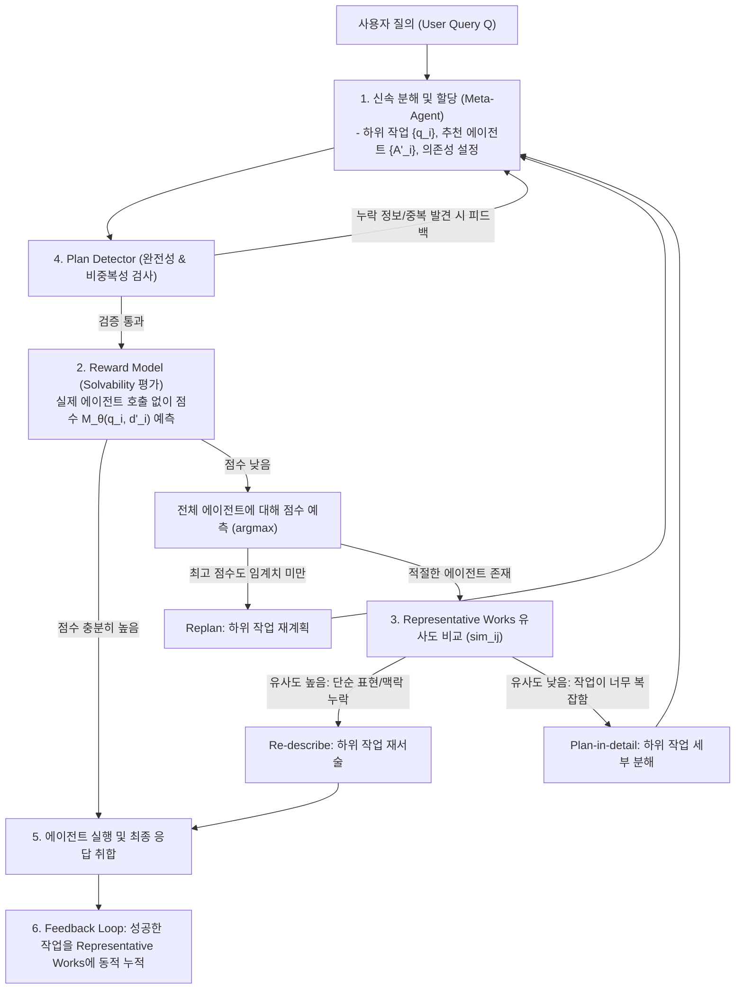

# [논문 정리] Agent-Oriented Planning in Multi-Agent Systems (AOP)

> **원제**: Agent-Oriented Planning in Multi-Agent Systems  
> **저자**: Ao Li, Yuexiang Xie, Songze Li, Fugee Tsung, Bolin Ding, Yaliang Li (HKUST, Alibaba Group, Southeast University)  
> **발표/상태**: ICLR 2025 제출 / arXiv:2410.02189  
> **공식 코드**: [GitHub - lalaliat/Agent-Oriented-Planning](https://github.com/lalaliat/Agent-Oriented-Planning)

---

## 1. 개요 및 연구 동기 (Motivation)

최근 대규모 언어 모델(LLM) 기반의 다중 에이전트 시스템(Multi-Agent Systems, MAS)은 각기 다른 전문 도구와 역량을 가진 에이전트들이 협력하여 복잡한 현실 문제를 해결하는 강력한 패러다임으로 주목받고 있습니다.

다중 에이전트 시스템의 성패는 사용자 질의(User Query)를 여러 하위 작업(Sub-task)으로 분해하고 각 하위 작업을 가장 적합한 에이전트에 할당하는 **메타 에이전트(Meta-Agent / Controller / Planner)**의 역할에 달려 있습니다. 이를 **에이전트 지향적 계획(Agent-Oriented Planning, AOP)**이라 부릅니다.

### 기존 접근법의 한계점
1. **단순 프롬프트 기반 분해(HuggingGPT, Chameleon 등)의 한계**:
   - 에이전트의 실제 해결 역량을 세밀하게 고려하지 못하고, 단순 설명(description) 텍스트에만 의존하여 하위 작업을 분해/할당함.
   - 하위 작업의 표현 방식, 세분성(granularity), 컨텍스트 누락 등으로 인해 에이전트가 실패하는 경우가 빈번함.
2. **인터리브 방식(ReAct, HUSKY 등)의 비용 및 환각 문제**:
   - 추론과 실행을 반복적으로 교차 수행하는 과정에서 히스토리 트레이스(trajectory)가 길어져 토큰 비용이 급증하고 환각(hallucination)이 누적됨.
3. **무차별 전수 호출(Brute-force Trial)의 비현실성**:
   - 하위 작업 $m$개, 에이전트 $n$개일 때 매번 모든 에이전트를 실제로 호출하여 최적을 고르려면 최소 $m \times n$번의 무거운 API/도구 호출이 발생하여 비용과 지연시간이 감당 불가 수준에 이름.

이를 해결하기 위해 본 논문은 **3대 설계 원칙**을 정립하고, 실제 에이전트를 직접 호출하지 않고도 계획의 질과 실행 가능성을 사전 검증 및 반복 개선하는 프레임워크인 **AOP**를 제안합니다.

---

## 2. 에이전트 지향 계획의 3대 핵심 설계 원칙

논문에서는 효과적이고 효율적인 하위 작업 분해 및 할당을 위해 다음 세 가지 원칙을 제시합니다:

```
                  ┌────────────────────────────────────────┐
                  │      Agent-Oriented Planning 원칙      │
                  └───────────────────┬────────────────────┘
          ┌───────────────────────────┼───────────────────────────┐
          ▼                           ▼                           ▼
┌───────────────────┐       ┌───────────────────┐       ┌───────────────────┐
│   1. Solvability  │       │  2. Completeness  │       │ 3. Non-Redundancy │
│    (해결 가능성)    │       │     (완전성)      │       │    (비중복성)     │
├───────────────────┤       ├───────────────────┤       ├───────────────────┤
│ 각 하위 작업은     │       │ 하위 작업들의      │       │ 질의와 무관하거나 │
│ 최소 하나의 단일  │       │ 조합은 원래       │       │ 중복되는 하위     │
│ 에이전트에 의해    │       │ 질의 해결에       │       │ 작업을 제거하여    │
│ 온전히 해결 가능    │       │ 필요한 모든 정보  │       │ 최소 유효 집합을  │
│ 해야 함           │       │ 를 포함해야 함    │       │ 구성해야 함       │
└───────────────────┘       └───────────────────┘       └───────────────────┘
```

1. **해결 가능성 (Solvability)**:
   - 각 하위 작업 $q_i$는 시스템 내 적어도 하나의 전문 에이전트가 단독으로 완결성 있게 풀 수 있는 수준의 크기와 명확성을 가져야 함.
2. **완전성 (Completeness)**:
   - 분해된 하위 작업들의 집합 $\{q_1, \dots, q_m\}$은 원래 사용자 질의 $Q$에 포함된 모든 핵심 조건, 엔티티, 제약사항을 포함해야 하며, 빠진 정보가 없어야 함.
3. **비중복성 (Non-Redundancy)**:
   - 중복되거나 불필요한 하위 작업이 없어야 함 (최소한의 필수 작업 집합 지향). 단, 에이전트 가용성 장애에 대비한 에이전트 수준의 폴트 톨러런스 이중화와 태스크 레벨 중복은 구별됨.

---

## 3. AOP 프레임워크 상세 구조

AOP는 메타 에이전트가 초안 계획을 생성한 뒤, 경량 보상 모델과 탐지기(Detector)를 통해 계획을 검증·수정하는 **사전 검증 및 반복 개선 파이프라인**을 갖추고 있습니다.



### (1) 신속 분해 및 할당 (Fast Decomposition and Allocation)
- 메타 에이전트(LLM)에 사용자 질의 $Q$와 전체 에이전트 설명 목록 $\mathcal{D}$를 함께 프롬프트로 제공.
- **분해(Decomposition)**와 **할당(Allocation)**을 순차 분리하지 않고 **동시에 수행**하도록 하여 에이전트 역량을 의식하면서 하위 작업을 나누도록 유도.
- 하위 작업 간의 선후 의존성(`dep`)을 명시하여 논리적 실행 순서를 확립.
- 이 단계의 출력은 확정된 결과가 아닌 **수정 가능한 중간 산출물(Intermediate Output)**로 취급.

### (2) 보상 모델 (Reward Model) 기반 Solvability 평가
실제 에이전트를 호출하여 실행해 보지 않고도, 특정 하위 작업 $q_i$가 에이전트 $d_j$에 의해 해결 가능한지 사전에 평가:
- **모델 구조**: 경량 텍스트 임베딩 모델(`all-MiniLM-L6-v2`, 384차원) + 3층 MLP(256 $\rightarrow$ 64 $\rightarrow$ 1).
  - 하위 작업 텍스트 임베딩과 에이전트 설명 임베딩을 결합(Concatenate, 총 768차원)하여 MLP 입력으로 사용.
  - 임베딩 레이어는 동결(freeze)하고 MLP만 학습하여 가볍고 빠르게 학습 가능.
- **학습 데이터 및 손실 함수**:
  - 오프라인에서 메타 에이전트가 생성한 하위 작업들을 에이전트들에 할당하고 실행.
  - LLM 또는 인간 평가자(Scorer $\mathcal{S}$)가 정확성(Correctness), 관련성(Relevance), 완전성(Completeness) 관점에서 점수 $s_{k,i,j}$를 부여.
  - 평균 제곱 오차(MSE)를 최소화하도록 학습:
    $$L(\mathcal{T}, \theta) = \frac{1}{K} \sum_{k=1}^K \frac{1}{m_k} \sum_{i=1}^{m_k} \frac{1}{l} \sum_{j=1}^l (s_{k,i,j} - \mathcal{M}_\theta(q_{k,i}, d_{k,i,j}))^2$$
- **의사결정 분기**:
  - 추천된 에이전트 점수가 임계치 이상 $\rightarrow$ 승인 후 실행.
  - 점수가 낮을 경우 $\rightarrow$ 시스템 내 모든 에이전트에 대해 점수 예측 후 최적 에이전트 탐색.
  - 만약 시스템 내 어떤 에이전트도 기준 점수를 넘지 못하면 $\rightarrow$ **Replan(재계획)** 트리거.

### (3) 대표 작업 기록(Representative Works)을 활용한 하위 작업 수정
할당된 에이전트의 보상 점수가 적정하더라도 실제 수행 시 실패할 수 있는 두 가지 근본 원인을 분석하고 해결:
1. **문제의 원인 구분**:
   - **원인 A**: 하위 작업 지시문에 대명사, 모호한 표현, 이전 단계 컨텍스트 누락.
   - **원인 B**: 하위 작업 자체가 단일 에이전트가 처리하기에는 너무 복잡함.
2. **Representative Works 비교 메커니즘**:
   - 각 에이전트가 과거에 완벽히 해결했던 하위 작업 목록($\mathcal{Q}_j$)을 관리.
   - 현재 하위 작업 $q_i$와 대표 작업 $q_t \in \mathcal{Q}_j$ 간의 코사인 유사도 계산:
     $$sim(q_i, \mathcal{Q}_j) = \max_{q_t \in \mathcal{Q}_j} \cos(\mathcal{E}(q_i), \mathcal{E}(q_t))$$
   - **유사도가 높을 때** $\rightarrow$ 유사한 문제를 푼 적이 있으므로 **Re-describe (재서술)**을 수행하여 표현 모호성을 정제.
   - **유사도가 낮을 때** $\rightarrow$ 에이전트 역량을 초과하는 복잡한 문제로 판단하여 **Plan-in-detail (세부 분해)**을 수행하여 더 작은 단위로 쪼갬.

### (4) 완전성 및 비중복성 탐지기 (Plan Detector)
- LLM에 Plan Detector 역할을 부여하여 중간 계획 검사.
- **Completeness 검사**: 원래 질의의 모든 핵심 명사, 숫자, 조건이 하위 작업에 반영되었는지, 숨겨진 선행 의존성이 있는지 검증.
- **Non-redundancy 검사**: 두 개 이상의 하위 작업이 동일한 내용을 다루거나 불필요한 작업을 수행하는지 검증.
- 문제 발견 시 구체적 개선 피드백을 생성하여 메타 에이전트가 계획을 수정하도록 유도.

### (5) 피드백 루프 (Feedback Loop)
- 성공적으로 해결된 하위 작업은 해당 에이전트의 Representative Works에 동적으로 추가됨.
- 이때 기존 데이터와의 유사도 임계치를 두어, 다양성을 유지하고 중복을 방지하며 지속적인 성능 향상을 도모.

---

## 4. 실험 및 주요 결과 분석

### (1) 실험 환경
- **벤치마크 데이터셋**: Husky-QA (다단계 복합 추론 질의, Train 1,440건 / Test 292건), 추가 실험으로 DROP 및 IIRC 서브셋 활용.
- **에이전트 구성**: Code Agent (파이썬 코드 실행), Math Agent (수학적 단계 추론), Search Agent (Bing Search API 연동), Commonsense Agent (상식 추론). 모든 에이전트 백본은 GPT-4o 사용.
- **평가 지표**: 정확도(Accuracy, %), 사용 토큰 수(Prompt/Completion Tokens), 전체 소요 시간(Time, s).

### (2) 전체 성능 비교 (Husky-QA 테스트셋 기준)

| 구분 | 방법론 (Method) | Accuracy (%) | Prompt Tokens (M) | Completion Tokens (M) | Time (s) |
| :--- | :--- | :---: | :---: | :---: | :---: |
| **단일 에이전트** | GPT-4o (Direct) | 33.3 | 0.02 | 0.09 | 1,968 |
| | CoT (Chain-of-Thought) | 35.6 | 0.07 | 0.08 | 1,375 |
| | Zero-Shot CoT | 32.2 | 0.02 | 0.11 | 1,565 |
| **다중 에이전트** | Meta-Agent (단순 1회 할당) | 30.0 | 0.65 | 0.13 | 5,364 |
| | Meta-Agent: Traversal (전수 탐색) | 35.2 | 3.07 | 0.69 | 23,175 |
| | REACT | 37.6 | 2.47 | 0.19 | 11,510 |
| | HUSKY | 39.6 | 0.83 | 0.15 | 10,394 |
| **제안 기법** | **AOP (Ours)** | **43.7** | 1.12 | 0.38 | 11,869 |

#### 결과 분석
1. **단일 에이전트 대비 압도적 성능**: AOP는 기본 GPT-4o 대비 **+10.4%p**, CoT 대비 **+8.1%p** 향상.
2. **기존 멀티 에이전트 방식 대비 우수성**: 단순 Meta-Agent(30.0%) 대비 **+13.7%p**, 기존 SOTA 멀티 에이전트 프레임워크인 HUSKY(39.6%) 대비 **+4.1%p** 높은 정확도 달성.
3. **비용 효율성**: 모든 에이전트를 전수 탐색하는 Meta-Agent: Traversal(23,175초, 3.07M 프롬프트 토큰)에 비해 **절반 이하의 시간과 토큰**을 소모하면서도 훨씬 높은 정확도를 기록.

---

### (3) 절제 연구 (Ablation Study)

AOP의 각 구성 요소가 시스템 전체 성능에 미치는 영향을 분석한 결과:

| 모델 변형 | Accuracy (%) | 비고 |
| :--- | :---: | :--- |
| **AOP (Full Model)** | **43.7** | 모든 모듈 적용 |
| **w/o Plan Detector** | 36.6 | **-7.1%p** (가장 큰 성능 하락: 불완전 계획 발생) |
| **w/o Reward Model** | 38.7 | **-5.0%p** (부적절한 에이전트 할당 발생) |
| **w/o Representative Works** | 41.1 | **-2.6%p** (하위 작업 표현 및 세분화 실패) |

- **Plan Detector의 중요성**: 제거 시 정확도가 36.6%로 급락함. 초기 분해 시 15% 이상 발생하는 정보 누락 및 의존성 오류를 걸러내는 것이 시스템 성능에 결정적임.
- **Reward Model & Representative Works**: 두 모듈이 결합하여 실제 에이전트를 낭비하지 않고도 Solvability를 확보함을 입증.

---

### (4) Scorer 및 보상 모델 고도화 영향

| 설정 | Accuracy (%) | 설명 |
| :--- | :---: | :--- |
| **AOP (기본: LLM Scorer + MLP FT)** | 43.7 | 기본 설정 (비용 효율적) |
| **+ Manual Scoring (인간 전문가 라벨링)** | 46.9 | 고품질 데이터셋 기반 학습 시 +3.2%p |
| **+ Full Parameter Tuning (임베딩까지 전체 튜닝)** | **47.9** | 임베딩 레이어까지 미세조정 시 +4.2%p |

- 데이터의 질과 파라미터 튜닝 정도에 따라 성능이 추가로 확장될 수 있음을 시사.

---

## 5. 핵심 시사점 및 결론 (Discussion & Takeaways)

1. **Inference-Time Compute 패러다임과의 정렬**:
   - 단순히 큰 모델을 1회 호출하거나 단순 프롬프트로 작업을 쪼개는 것만으로는 복잡한 다단계 도구 활용 문제를 풀기 어려움.
   - 추론 시점에 경량 평가 모델과 검증기(Detector)를 통해 계획을 다듬는 '생각하는 시간(Inference-Time Reasoning & Verification)'에 연산 자원을 투자하는 것이 최종 성공률을 비약적으로 높임.
2. **실제 도구 호출 비용 절감**:
   - 도구/에이전트 호출은 외부 API 비용, 대기 시간, 레이트 리밋 등의 오버헤드가 큼.
   - 경량 보상 모델($\mathcal{M}_\theta$)을 통해 사전 스크리닝함으로써 불필요한 에이전트 호출을 최소화함.
3. **대표 작업(Representative Works)과 메모리 기반 에이전트 개선**:
   - 에이전트의 역량을 단순히 정적인 텍스트 설명으로만 파악하지 않고, 성공 경험 데이터를 축적하여 작업의 난이도와 서술 적합성을 판단하는 피드백 루프 설계는 향후 자율 에이전트 시스템에 필수적인 설계 패턴임.
