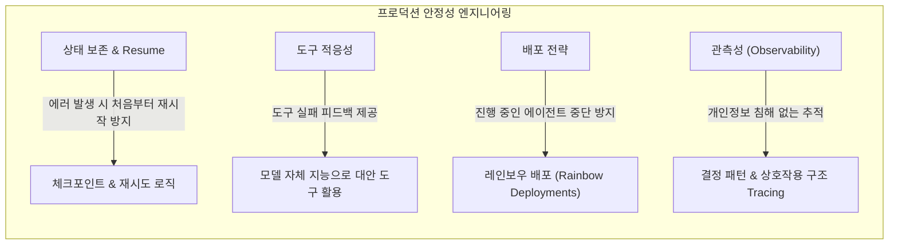

# Anthropic의 멀티 에이전트 리서치 시스템 구축기 심층 정리 및 요약
> **원문**: *How we built our multi-agent research system* (Anthropic Engineering Blog, 2025년 6월 13일)  
> **저자**: Jeremy Hadfield, Barry Zhang, Kenneth Lien, Florian Scholz, Jeremy Fox, Daniel Ford (Anthropic Apps Engineering Team)

---

## 1. 개요 (Executive Summary)

Anthropic은 복잡하고 광범위한 조사 과제를 자율적으로 수행하기 위해 Claude 기반의 **멀티 에이전트 리서치 시스템(Multi-Agent Research System)**을 구축하고 서비스에 적용했습니다. 웹, Google Workspace, 다양한 외부 연동 도구(MCP 등)를 활용하여 사용자 질문을 해결합니다.

이 문서는 단순 프로토타입에서 대규모 상용 프로덕션 시스템으로 발전시키는 과정에서 겪은 **시스템 아키텍처, 프롬프트 엔지니어링, 평가(Evaluation) 방법론, 프로덕션 신뢰성 엔지니어링**의 교훈과 핵심 원칙을 종합적으로 정리한 기술 문서입니다.

---

## 2. 왜 멀티 에이전트 시스템인가? (Benefits & Motivation)

### 2.1 리서치 업무의 본질적 특성
* **비예측성과 경로 의존성(Path-dependency)**:
  * 리서치는 사전에 필요한 스텝을 고정된 파이프라인(Hardcoded pipeline)으로 정의할 수 없는 개방형(Open-ended) 문제입니다.
  * 조사 중간에 발견된 단서에 따라 접근 방식을 계속해서 수정(Pivot)해야 합니다.
  * 기존의 정적 RAG(Retrieval-Augmented Generation)나 1회성 선형 파이프라인으로는 복잡한 리서치를 수행할 수 없습니다.

### 2.2 핵심 메커니즘: 압축(Compression)과 관심사 분리(Separation of Concerns)
* **검색의 본질 = 압축**: 방대한 말뭉치(Corpus)에서 핵심 인사이트를 걸러내는 작업입니다.
* **독립된 컨텍스트 윈도우**:
  * 서브에이전트들은 각각 독립된 컨텍스트 윈도우를 갖고 병렬로 서로 다른 측면을 탐색합니다.
  * 수집된 방대한 데이터 중 가장 중요한 토큰만을 선별·압축하여 리드(Lead) 에이전트에게 전달합니다.
* **관심사 분리**: 서브에이전트마다 고유한 도구, 프롬프트, 탐색 궤적을 부여하여 편향과 경로 의존성을 줄이고 철저한 독립 조사를 가능하게 합니다.

### 2.3 성능 향상 지표 및 토큰 경제학
* **성능 향상**:
  * 내부 리서치 벤치마크에서 **Claude Opus 4(Lead) + Claude Sonnet 4(Subagent)** 멀티 에이전트 시스템은 **단일 Claude Opus 4 에이전트 대비 90.2% 높은 성능**을 기록했습니다.
  * 예시: *"S&P 500 IT 기업의 모든 이사회 구성원 식별"* 과제에서 단일 에이전트는 순차적 검색의 한계로 실패했으나, 멀티 에이전트는 서브에이전트 분할 병렬 처리로 성공했습니다.
* **토큰 소비량과 성능 상관관계 (BrowseComp 분석)**:
  * 브라우징 에이전트 평가(BrowseComp) 분산의 **95%**가 3가지 요인으로 설명됩니다:
    1. **토큰 소비량 (분산의 80% 설명)**: 문제를 해결할 만큼 "충분한 토큰을 쓰도록 구조화"하는 것이 성공의 핵심.
    2. 도구 호출(Tool call) 횟수
    3. 모델 선택 (Sonnet 3.7의 토큰 예산을 2배 늘리는 것보다 **Claude Sonnet 4로 업그레이드하는 것이 더 큰 성능 이득** 제공).
* **트레이드오프 및 적용 한계**:
  * **비용(토큰 소모)**: 일반 챗 대비 단일 에이전트는 약 4배, 멀티 에이전트는 **약 15배의 토큰**을 소비합니다. 따라서 그만한 가치를 창출할 수 있는 고부가가치 태스크에 적합합니다.
  * **비적합 영역**: 모든 에이전트가 동일 컨텍스트를 실시간 공유해야 하거나 상호 의존성이 높은 태스크(예: 대부분의 단일 코드베이스 수정 코딩 태스크)는 아직 멀티 에이전트가 비효율적일 수 있습니다.
  * **적합 영역**: 높은 병렬성, 단일 컨텍스트 초과 정보량, 복잡한 다중 도구 연동이 요구되는 심층 조사 과제.

---

## 3. 시스템 아키텍처 (Architecture Overview)

리서치 시스템은 **오케스트레이터-워커 패턴(Orchestrator-Worker Pattern)**을 채택하고 있으며, 후처리를 위한 전용 인용(Citation) 에이전트를 결합했습니다.

```mermaid
flowchart TD
    UserQuery(["사용자 질의 (User Query)"]) --> Lead["리드 연구원 (LeadResearcher Agent)"]
    
    subgraph LeadOperations ["LeadResearcher의 역할 및 루프"]
        Lead --> Plan["계획 수립 & 메모리 저장 (200k 토큰 트렁케이션 대비)"]
        Plan --> Orchestrate["서브에이전트 생성 및 병렬 위임"]
    end
    
    Orchestrate --> Sub1["서브에이전트 1 (Subagent)"]
    Orchestrate --> Sub2["서브에이전트 2 (Subagent)"]
    Orchestrate --> SubN["서브에이전트 N (Subagent)"]
    
    subgraph SubagentExecution ["각 서브에이전트의 자율 실행"]
        Sub1 --> Search1["웹/도구 병렬 검색 (3+ 도구 동시 호출)"]
        Search1 --> Thinking1["Interleaved Thinking (결과 평가 및 쿼리 보정)"]
        Thinking1 --> Result1["압축된 핵심 결과 요약"]
    end
    
    Result1 --> Synthesize["결과 종합 & 추가 리서치 필요 여부 판단"]
    Synthesize -- "추가 조사 필요" --> Orchestrate
    Synthesize -- "조사 완료" --> Citation["인용 에이전트 (CitationAgent)"]
    
    subgraph CitationStep ["신뢰성 보증 단계"]
        Citation --> Match["최종 보고서와 원본 문서 대조"]
        Match --> Attach["정확한 출처 위치에 인용(Citation) 매핑"]
    end
    
    Attach --> FinalAnswer(["최종 인용 포함 리서치 보고서 전달"])
```

### 핵심 컴포넌트별 역할
1. **LeadResearcher (오케스트레이터)**:
   * 사용자 쿼리를 분석하고 전체 리서치 전략과 계획을 수립.
   * 컨텍스트 윈도우가 200,000 토큰을 초과하여 잘려 나갈(Truncated) 경우에 대비해 계획을 **외부 메모리(Memory)**에 보존.
   * 작업의 난이도와 유형에 맞춰 적정 수의 특화 서브에이전트를 동적으로 생성하고 위임.
   * 중간 결과를 종합하여 추가 조사가 필요한지, 조사를 종료할지 반복 판단.
2. **Subagents (워커 에이전트)**:
   * 구체적이고 명확한 하위 리서치 목표를 부여받음.
   * 병렬 도구 호출(Parallel Tool Calling)을 통해 검색 및 데이터 수집.
   * **Interleaved Thinking**을 통해 도구 실행 결과를 즉각 비판적으로 평가하고 다음 쿼리를 수정.
   * 정제·압축된 핵심 결과만을 리드 에이전트에 반환.
3. **CitationAgent (인용 전용 에이전트)**:
   * 리서치 루프 종료 후 수집된 모든 원본 문서와 최종 리서치 리포트를 대조.
   * 본문의 각 주장에 대해 정확한 1차 출처 링크와 인용 위치를 매핑하여 환각(Hallucination) 방지 및 신뢰도 확보.

---

## 4. 프롬프트 엔지니어링 핵심 원칙 (Prompting Principles)

멀티 에이전트 시스템에서는 단일 에이전트와 달리 에이전트 간 조율 복잡도가 기하급수적으로 증가합니다(초기에는 단순 질의에 50개의 서브에이전트를 띄우거나 무한 루프에 빠지는 오류 발생). Anthropic이 정립한 8가지 프롬프트 엔지니어링 원칙은 다음과 같습니다:

| 번호 | 원칙 | 핵심 설명 및 프랙티스 |
| :--- | :--- | :--- |
| **1** | **에이전트 관점에서 생각하기<br>(Think like your agents)** | 콘솔(Console) 시뮬레이터를 구축하여 프롬프트와 툴이 적용된 에이전트의 실행 과정을 한 단계씩 관찰. 조기 종료 실패, 장황한 쿼리, 잘못된 도구 선택 등의 failure mode를 직접 보고 멘탈 모델을 수립함. |
| **2** | **위임 방법 구체화<br>(Teach how to delegate)** | 단순 지시("반도체 부족 조사해")는 중복 조사나 엉뚱한 방향(2021년 차량용 반도체 vs 2025년 공급망 중복)을 초래함. **구체적 목표, 출력 형식, 추천 도구/출처, 명확한 작업 경계(Boundaries)**를 프롬프트로 명시하도록 리드 에이전트를 교육. |
| **3** | **쿼리 복잡도에 따른 노력 스케일링<br>(Scale effort to query complexity)** | 에이전트는 작업 난이도에 적절한 리소스를 스스로 판단하기 어려움. 명시적 가이드라인 삽입:<br>• **단순 사실 확인**: 에이전트 1개, 툴 호출 3~10회<br>• **직접 비교**: 서브에이전트 2~4개, 각 10~15회 호출<br>• **심층 복합 리서치**: 서브에이전트 10개 이상, 명확한 역할 분담 |
| **4** | **도구 설계 및 선택 가이드<br>(Tool design & selection)** | 도구 설명(Description)은 사람의 UI와 같음. MCP 도구 연동 시 품질이 제각각이므로, "가용 툴 전체 먼저 탐색", "광범위한 외부 조사는 웹 검색", "일반 도구보다 특화 도구 우선" 등 명확한 선택 휴리스틱 제공. |
| **5** | **에이전트를 통한 자체 개선<br>(Self-improving agents)** | Claude 4는 뛰어난 프롬프트 엔지니어임. 결함이 있는 MCP 도구를 수십 번 테스트하고 도구 설명을 스스로 재작성하는 **'도구 테스팅 에이전트(Tool-testing agent)'**를 운영 -> 후속 에이전트의 **태스크 완료 시간 40% 단축**. |
| **6** | **넓게 시작해 좁혀가기<br>(Start wide, then narrow down)** | 인간 전문가의 조사 방식을 모방. 처음부터 지나치게 구체적이고 긴 쿼리를 날려 검색 결과가 0건이 되는 것을 방지하기 위해, 초반에는 짧고 넓은 키워드로 지형을 탐색한 뒤 점진적으로 구체화하도록 유도. |
| **7** | **사고 과정 유도<br>(Extended & Interleaved Thinking)** | • **Extended Thinking**: 리드 에이전트가 복잡도 판단, 서브에이전트 수/역할 정의 등을 사전에 계획하는 스크래치패드로 활용.<br>• **Interleaved Thinking**: 서브에이전트가 도구 결과를 받은 직후 품질을 비판적으로 검증하고 갭을 채우는 쿼리를 재설계하는 데 활용. |
| **8** | **병렬 도구 호출의 극대화<br>(Parallel tool calling)** | (1) 리드 에이전트가 3~5개 서브에이전트를 병렬 생성, (2) 각 서브에이전트가 3개 이상의 툴을 병렬 호출. 이를 통해 순차 실행 대비 **리서치 소요 시간 최대 90% 단축** (수 시간 걸릴 작업을 수 분 내 완료). |

> **핵심 전략 요약**: 엄격하고 경직된 규칙(Rigid rules)보다는 **인간의 문제 해결 방식에 기반한 좋은 휴리스틱(Good heuristics)**과 탈선을 막는 가드레일을 주입하는 것이 핵심입니다.

---

## 5. 멀티 에이전트 평가 방법론 (Effective Evaluation)

멀티 에이전트는 입력이 같아도 매번 다른 탐색 경로를 거치므로 전통적인 소프트웨어 테스트나 단순 입력-출력 매칭 테스트로는 평가할 수 없습니다.

### 5.1 소규모 샘플로 즉각 시작 (Start small, immediately)
* 개발 초기에는 프롬프트 개선 하나만으로도 성공률이 30%에서 80%로 급등하는 등 효과 크기(Effect size)가 매우 큽니다.
* 수백 개의 벤치마크가 구축될 때까지 기다리지 말고, 실제 사용자 사용 패턴을 대표하는 **약 20개의 핵심 쿼리 세트**로 즉시 테스트를 시작하고 빠른 피드백 루프를 돌리는 것이 중요합니다.

### 5.2 LLM-as-a-Judge를 활용한 대규모 자동화
* 리서치 결과물은 정형화되지 않은 자유 형식(Free-form text) 텍스트입니다.
* **평가 루브릭 기준 (5대 지표)**:
  1. **사실 정확도 (Factual Accuracy)**: 주장이 수집된 출처와 일치하는가?
  2. **인용 정확도 (Citation Accuracy)**: 인용된 출처가 해당 주장을 실제로 뒷받침하는가?
  3. **완전성 (Completeness)**: 사용자가 요청한 모든 측면을 다루었는가?
  4. **출처 품질 (Source Quality)**: 저품질 2차 출처 대신 권위 있는 1차 출처(Primary sources)를 우선했는가?
  5. **도구 효율성 (Tool Efficiency)**: 적절한 도구를 합리적인 횟수로 사용했는가?
* **단일 프롬프트 단일 판사(Single LLM Call)**: 여러 개의 심사위원을 복잡하게 두는 것보다, 명확한 루브릭을 가진 단일 프롬프트에서 `0.0 ~ 1.0` 점수와 Pass/Fail을 부여하도록 하는 방식이 인간 평가와 가장 일관되게 일치했습니다.

### 5.3 인간 평가(Human Evaluation)의 필수성
* 자동화 평가가 잡지 못하는 미묘한 편향을 사람이 포착합니다.
* **실제 사례**: 초기 에이전트들이 학술 논문 PDF나 개인 기술 블로그처럼 권위 있지만 덜 최적화된 사이트 대신, **SEO에만 최적화된 콘텐츠 팜(Content farms)을 지속적으로 선택하는 편향**을 인간 테스터가 발견하였고, 이를 프롬프트에 출처 품질 휴리스틱으로 반영하여 해결했습니다.

---

## 6. 프로덕션 안정성 및 엔지니어링 과제 (Production Reliability)

에이전트 시스템은 장시간 실행(Long-running)되며 상태를 유지(Stateful)하므로, 전통적 소프트웨어보다 사소한 버그가 전체 시스템 붕괴로 이어지기 쉽습니다.



1. **상태 관리 및 복합 오류 (Stateful & Compounding Errors)**:
   * 장시간 실행 중 도구 오류가 발생했을 때 처음부터 전체를 재시작하는 것은 토큰 낭비이자 사용자 경험 저하입니다.
   * 오류 발생 지점에서 **재개(Resume)**할 수 있는 시스템과 체크포인트 메커니즘을 구축했습니다.
   * 도구 에러 발생 시 에이전트에게 오류 내용을 피드백하여 에이전트가 다른 도구나 쿼리로 스스로 적응하게 만들었습니다.
2. **비결정론적 특성을 다루는 새로운 디버깅 (Observability & Tracing)**:
   * 사용자가 "에이전트가 당연한 정보를 못 찾는다"고 할 때 원인을 파악하기 위해 엔드투엔드 프로덕션 트레이싱을 도입했습니다.
   * 대화 내용 자체를 들여다보지 않으면서(사용자 프라이버시 보호), **에이전트의 결정 패턴과 상호작용 구조**만을 모니터링하여 병목과 실패 원인을 체계적으로 분석했습니다.
3. **레인보우 배포 (Rainbow Deployments)**:
   * 장시간 실행되는 에이전트가 존재하는 환경에서 일괄 배포는 실행 중인 작업을 깨뜨립니다.
   * 구버전과 신버전을 동시에 구동하며 신규 유입 트래픽을 점진적으로 전환하는 레인보우 배포를 도입하여 가동 중인 에이전트의 연속성을 보장했습니다.
4. **동기식 vs 비동기식 실행 (Synchronous Bottleneck to Asynchronous Future)**:
   * 현재 리드 에이전트는 서브에이전트 그룹이 완료될 때까지 동기식(Synchronous)으로 대기합니다.
   * 이는 조율은 단순하지만 단 하나의 서브에이전트 지연으로 전체가 블로킹되는 병목이 존재합니다.
   * 향후에는 비동기(Asynchronous) 방식으로 고도화하여 실시간 방향 전환과 동시성을 극대화할 예정입니다.

---

## 7. 실제 사용자 활용 양상 (Real-World Use Cases)

Anthropic의 사용자 데이터(Clio 임베딩 분석) 기준, 리서치 기능의 상위 5대 활용 분야는 다음과 같습니다:

```
[1] 전문 도메인 소프트웨어 시스템 개발 (10%)
    ██████████ 10%
[2] 전문/기술 콘텐츠 개발 및 최적화 (8%)
    ████████ 8%
[3] 비즈니스 성장 및 수익 창출 전략 수립 (8%)
    ████████ 8%
[4] 학술 연구 및 교육 자료 개발 지원 (7%)
    ███████ 7%
[5] 인물, 장소, 조직 정보 조사 및 검증 (5%)
    █████ 5%
```

---

## 8. 부록: 고급 아키텍처 실전 팁 (Appendix Insights)

### 8.1 상태 변경 에이전트의 최종 상태 평가 (End-state Evaluation)
* 읽기 전용 리서치와 달리 환경을 실제로 수정(Mutate)하는 에이전트는 단계별 일치 여부 대신 **최종 결과 상태(End-state)** 또는 주요 체크포인트 도달 여부로 평가해야 합니다. 에이전트가 목표에 도달하는 유효한 경로는 다양하기 때문입니다.

### 8.2 장기 대화 컨텍스트 관리 (Long-horizon Context Management)
* 수백 턴 이상 이어지는 대화에서는 컨텍스트 윈도우 한계가 필연적입니다.
* 작업 단계가 완료될 때마다 핵심 내용을 요약하여 **외부 메모리(External Memory)**에 기록하고, 한계 임박 시 깨끗한 컨텍스트를 가진 새 서브에이전트를 생성하여 이전 계획을 메모리에서 불러오는 방식으로 컨텍스트 오버플로우를 방지합니다.

### 8.3 '말전달 게임(Game of Telephone)' 방지를 위한 파일시스템 직접 출력
* 서브에이전트가 수집·생성한 방대한 결과물을 매번 리드 에이전트와의 대화 메시지로 모두 주고받으면 **토큰 낭비**와 **정보 왜곡/누락**이 발생합니다.
* 서브에이전트가 코드, 리포트, 시각화 결과물 등을 **파일시스템/아티팩트 시스템에 직접 영구 저장(Persist)**하고, 리드 에이전트에게는 **경량 참조 포인터(Lightweight Reference)**만 전달하는 아키텍처를 도입하여 충실도와 성능을 대폭 향상시켰습니다.

---

## 9. 핵심 교훈 정리 (Key Takeaways for Developers)

1. **토큰을 과감하게 투자하라**: 어려운 과제는 충분한 추론 토큰과 독립된 컨텍스트를 제공해야 풀립니다.
2. **엄격한 규칙 대신 휴리스틱과 가드레일을 제공하라**: 분해 능력, 출처 비판 능력, 탐색 범위 조절 능력을 프롬프트로 가르쳐야 합니다.
3. **에이전트를 통해 도구를 개선하라**: Claude 4를 도구 테스터로 활용해 도구 명세를 자동 개선하면 실패율을 크게 낮출 수 있습니다.
4. **프로덕션의 핵심은 상태 복원력이다**: 중단 지점 재개(Resume), 레인보우 배포, 파일시스템 기반 아티팩트 분리 등 탄탄한 시스템 엔지니어링이 뒷받침되어야 성공할 수 있습니다.
