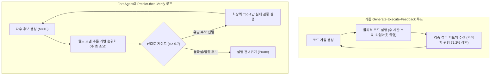
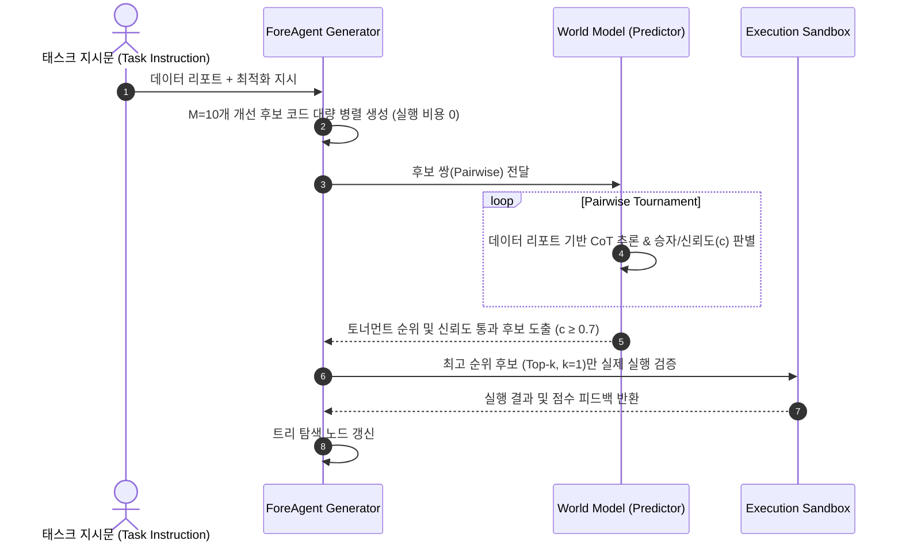

# [논문 요약/정리] Can We Predict Before Executing Machine Learning Agents?

- **논문 제목**: Can We Predict Before Executing Machine Learning Agents? (머신러닝 에이전트를 실행하기 전에 결과를 예측할 수 있을까?)
- **저자**: Jingsheng Zheng, Jintian Zhang, Yujie Luo, Yuren Mao, Yunjun Gao, Lun Du, Huajun Chen, Ningyu Zhang (Zhejiang University & Ant Group Joint Laboratory)
- **발표/식별자**: arXiv:2601.05930 (ForeAgent)
- **오픈소스 코드 & 데이터셋**: [GitHub Repository (zjunlp/predict-before-execute)](https://github.com/zjunlp/predict-before-execute)

---

## 1. 핵심 질문 및 연구 요약

> **Core Question**:  
> *"수 시간 동안 소요되는 물리적 코드 실행(Execution)을 수 초의 논리적 추론(Inference)으로 압축할 수 있을까?"*

기존의 자율형 머신러닝 에이전트(AIDE, AutoMind 등)는 **Generate-Execute-Feedback (생성-실행-피드백)** 루프에 의존합니다. 하지만 딥러닝 모델 학습과 실행에는 회당 수 시간(MLE-bench 기준 최대 9시간)이 소요되어 막대한 시간·컴퓨팅 비용이 발생하는 **실행 병목(Execution Bottleneck)**이 존재합니다. 또한 내부 검증 점수($M_{val}$)에 과적합되어 실제 테스트 성능($M_{test}$)을 깎아먹는 **검증-테스트 갭(Validation-Test Gap)** 문제도 심각합니다.

본 논문은 강화학습의 **월드 모델(World Model)** 개념에서 영감을 받아, **실행하지 않고도 정적 코드와 데이터 리포트만으로 솔루션의 상대적 우열을 사전 예측(Predict Before Executing)**하는 새로운 접근법을 제안합니다.

1. **새로운 태스크 정의**: **데이터 중심 솔루션 선호도 예측(Data-centric Solution Preference)** 태스크를 정식화하고, 실제 에이전트 실행 궤적에서 추출한 18,438개 쌍(pairwise) 비교 데이터셋을 구축했습니다.
2. **입력 증강(Verbal Data Report)**: LLM이 숫자 배열(Weak-semantic)을 직접 이해하기 어렵다는 점에 착안, 샌드박스에서 프로파일링된 수치 로그를 자연어 의미 리포트(Strong-structural)로 변환하는 **Profile-Verify-Verbalize** 파이프라인을 고안했습니다.
3. **실증적 검증**: 추론 특화 LLM(DeepSeek-V3.2-Thinking)이 **61.5%의 pairwise 정확도**를 달성하여 랜덤 추측(50.0%) 및 코드 복잡도 기반 휴리스틱(50.8%)을 유의미하게 능가함을 입증했습니다.
4. **에이전트 통합 (\textsc{ForeAgent})**: 예측 모델을 필터로 사용하는 **Predict-then-Verify** 루프를 구현하여, 기존 AIDE 대비 **수렴 속도 6배 단축($6\times$ Speedup)**, **탐색 공간 3.2배 확장($3.2\times$ Search Breadth)**, **성능 지표 +6% 향상**을 달성했습니다.

---

## 2. 연구 배경 및 동기 (Motivation)

### 2.1 기존 패러다임과 실행 병목 (Execution Bottleneck)
자율 머신러닝 에이전트는 데이터셋 $\mathcal{D}$와 태스크 지시문 $I$가 주어졌을 때 목표 지표 $M$을 최대화하는 최적 코드 $C^*$를 탐색합니다:
$$C^* = \arg\max_{C} M(I, C, \mathcal{D})$$

기존 에이전트는 다음과 같이 매 스텝 실제 물리적 실행 피드백 $R_t$를 받아 코드를 갱신합니다:
$$C_{t+1} \leftarrow \text{Agent}(I, C_t, \underbrace{\text{Execute}(C_t, \mathcal{D})}_{R_t})$$

- **문제점**: 딥러닝/머신러닝 학습은 심볼릭 코드 실행과 달리 수 시간 이상 걸리며, 타임아웃 오류가 빈번합니다. 수백 가지 가설을 검증하려면 수백 시간의 GPU 자원이 소모됩니다.

### 2.2 검증-테스트 갭 (Validation-Test Gap)
- 로컬 검증 세트 점수($M_{val}$)가 실제 비공개 테스트 세트($M_{test}$)의 우열 방향을 올바르게 반영하는 비율은 **72.2%**에 불과합니다.
- 즉, 에이전트가 로컬 검증 점수만 보고 코드를 개선하다 보면 **검증 세트 과적합(Validation Overfitting)**에 빠져 실제 성능은 저하되는 잘못된 탐색 경로로 깊이 빠져들게 됩니다.

---

## 3. 태스크 정식화 및 데이터셋 구축

### 3.1 Data-centric Solution Preference 태스크
- **입력 $\mathcal{X}$**: 태스크 지시문 $I$, 검증된 데이터 분석 리포트 $D_{rep}$, 두 개의 후보 코드 쌍 $\{C_0, C_1\}$, 시스템 프롬프트 $\mathcal{P}$
$$\mathcal{X} = \left( I, D_{rep}, \{C_0, C_1\}, \mathcal{P} \right)$$
- **출력 $\mathcal{Y}$**: 생각 사슬($cot$), 승자 예측값($\hat{y} \in \{0, 1\}$), 신뢰도 점수($c \in [0, 1.0]$)
$$\mathcal{Y} = \left\{ (cot, \hat{y}, c) \mid cot, \; \hat{y} \in \{0, 1\}, \; c \in [0, 1.0] \right\}$$

### 3.2 선호도 말뭉치(Preference Corpus) 구축
1. **실제 에이전트 탐색 궤적 수집**: MLE-bench 상에서 DeepSeek-V3.1 및 o3-mini 기반의 AIDE와 AutoMind가 생성한 실제 실행 궤적에서 1,329개 실행 가능한 솔루션을 추출했습니다.
2. **중간 상태(Intermediate States) 보존**: 단순 완성본뿐만 아니라, 문법 에러는 없으나 개선 여지가 있는 지저분한 중간 상태(half-baked) 코드들을 포함하여 실제 탐색 환경을 완벽히 모사했습니다.
3. **전문가 검수 및 쌍 구성 (Expert-in-the-Loop)**: 중복 제거, 분류 체계 태깅, 편향 완화(위치 편향 제거)를 통해 **895개 솔루션, 총 18,438개의 Pairwise 비교 데이터**를 최종 구축했습니다.

| 도메인 | 주요 패러다임 | 태스크 수 (# Tsk) | 고유 솔루션 수 (# Sols) | 비교 쌍 수 (# Pairs) |
| :--- | :--- | :---: | :---: | :---: |
| **CV (컴퓨터 비전)** | Classification, Segmentation, Gen/Restore | 9 | 289 | 5,952 |
| **NLP (자연어 처리)** | Classification, Matching, QA, Seq-Labeling, Ranking | 8 | 303 | 6,682 |
| **Data Science (데이터 과학)** | Regression, Time-Series, Audio, Tabular, Grading | 9 | 303 | 5,804 |
| **전체 합계 (Total)** | **26개 독립 태스크 (3개 도메인 균형)** | **26** | **895** | **18,438** |

### 3.3 검증된 데이터 분석 리포트 (Verified Data Report)
LLM은 원시 숫자 데이터(연속형 수치)를 임베딩 공간에서 잘 해석하지 못하는 한계(Weak-Semantic Symbol)가 있습니다. 이를 해결하기 위해 **3단계 Profile-Verify-Verbalize** 파이프라인을 구축했습니다:

1. **코드 생성 (Code Generation)**: 라벨을 마스킹한 채 원시 데이터의 메타 통계를 추출하는 파이썬 스크립트 작성 (예: `df['target'].value_counts()`).
2. **실행 및 검증 (Execution & Verification)**: 샌드박스에서 실행하여 런타임 에러 없는 정확한 로그 수집 (예: `Target Distribution: 0: 0.915, 1: 0.085`).
3. **자연어 구술화 (Verbalization)**: 실행 로그를 도메인 의미를 담은 문장으로 변환 (예: *"클래스 불균형 심각 (양성 8.5%). 단순 Accuracy 대신 F1-score 고려 필요"*).

---

## 4. 핵심 분석 및 주요 발견 (Analysis & Findings)

### Finding 1: 예측 성공 요인은 '단순 복잡도 휴리스틱'이 아닌 '의미론적 데이터 이해'
입력 모달리티를 점진적으로 확장하며 pairwise 정확도를 비교했습니다:
- **Random Guess**: 50.0%
- **Complexity Heuristic** (코드가 길고 복잡할수록 점수가 높다고 판정): 50.8%
- **Code Only** (태스크 지시문 + 코드만 제공): 56.7%
- **Raw Data** (원시 샘플 몇 개 추가): 57.1% (Code Only와 차이 미미, 원시 숫자는 CoT 모드에서 노이즈로 작용)
- **Numerical Stats** (스크립트 실행 수치 로그): 59.0%
- **Verbal Report (제안 방식)**: **61.3%**
- **Context Mismatch 대조군** (엉뚱한 다른 태스크의 리포트를 주입): 56.8% (Code Only 수준으로 급락)

> **Insight**: LLM이 솔루션을 올바르게 평가하는 것은 복잡한 모델을 선호해서가 아니며, **자연어로 요약된 데이터 특성과 알고리즘 간의 적합성을 논리적으로 추론**하기 때문입니다.

---

### Finding 2: 추론(Thinking)의 필수성 및 영역별 인지 경계

1. **Thinking Mode vs Direct Answering**:
   - 생각 사슬(CoT) 활성화 시: **61.3%**
   - 직접 답변(Direct): **55.9%**
   - 온도 변화($T \in [0, 1.5]$) 및 궤적 출처 차이에도 성능이 매우 안정적으로 유지됨.
2. **도메인 및 태스크 차원의 난이도 차이**:
   - 도메인: NLP (66.9%) > CV (59.3%) > Data Science (57.4%)
   - 알고리즘 세대: 전통적 ML (64.5%) > 최신 딥러닝 (60.4%) — 전통 ML의 가정이 더 명확하여 예측 용이
   - 비교 세밀도: Cross-Algo (서로 다른 알고리즘 비교, 62.8%) > Self-Comp. (동일 알고리즘 내 세부 수정 비교, 60.7%)
3. **리스트 순위화(Listwise Ranking)의 한계**:
   - $N=2$ (Pairwise)일 때 Top-1 정확도 61.3%이지만, $N=5$ 리스트로 확장 시 Top-1 정확도가 31.1%로 급락하며 Spearman 상관계수는 $\rho \approx 0.23$에 머뭅니다.
   - 따라서 다자간 비교 시에는 직접 리스트 순위를 매기기보다 **Pairwise 토너먼트 방식**을 취해야 함을 시사합니다.
4. **신뢰도 교정(Confidence Calibration)**:
   - 모델이 자체 측정한 신뢰도($c$)가 높을수록 실제 정답률이 비례하여 증가함이 확인되었습니다. 이는 에이전트가 신뢰도 임계값($c \ge 0.7$)을 안전장치로 사용할 수 있는 근거가 됩니다.

---

### Finding 3: 파라미터 스케일링 법칙(Scaling Law)의 위배와 추론 패러다임
Qwen 시리즈 모델을 4B부터 1T(Qwen-Max)까지 비교 분석한 결과:
- 4B에서 30B로 증가할 때는 성능이 향상되나, **30B 이후 235B, 480B, 1T에 이르기까지 성능이 뚜렷한 정체(Plateau)**를 보였습니다.
- 반면 DeepSeek-V3.2-Thinking (61.5%)과 GPT-5.1 (58.8%)은 높은 성능을 기록했습니다.
- **결론**: 본 태스크의 성능은 단순 파라미터 크기가 아니라, **사고 과정(Reasoning-centric / Thinking mode)**의 질과 훈련 패러다임에 의해 결정됩니다.

---

### Finding 4: 인간의 '복잡도 편향' 극복 (Case Studies)

#### Case 1: Google Quest Q&A 태스크
- **후보 솔루션**:
  - Solution 0: Cross-Attention이 포함된 복잡한 심층 신경망(DNN)
  - Solution 1: 경량의 견고한 LightGBM 앙상블
- **인간 평가자**: "더 깊고 복잡한 딥러닝 모델이 당연히 성능이 좋을 것"이라는 복잡도 편향(Complexity Bias)으로 Solution 0 선택 $\rightarrow$ **오답**.
- **월드 모델 (LLM)**: 데이터 리포트에서 샘플 수가 적고($N \approx 5.5k$) 타깃이 치우쳐 있음을 파악하여, 복잡한 DNN의 과적합(Overfitting) 위험을 정확히 예측하고 **Solution 1(LightGBM)을 선택 $\rightarrow$ 정답**.

#### Case 2: TGS Salt Identification 세그멘테이션 태스크
- **후보 솔루션**:
  - Solution 0: ImageNet 사전학습 Vision Transformer (ViT-B/16)
  - Solution 1: 표준 U-Net
- **인간 평가자**: 최신 SOTA 모델인 ViT를 맹신하여 Solution 0 선호.
- **월드 모델 (LLM)**: 입력 이미지가 $101 \times 101$의 소형 지진파 이미지인데, ViT의 필수 입력 규격인 $224 \times 224$로 강제 리사이징(보간)하면 미세한 소금 경계 디테일이 파괴된다는 점을 지적하며 **U-Net(Solution 1)을 선택 $\rightarrow$ 정답**.

---

## 5. \textsc{ForeAgent} 아키텍처 및 성능 평가

### 5.1 Predict-then-Verify 루프 동작 구조
AIDE의 트리 탐색 구조를 계승하되, Improvement 단계를 재설계했습니다:

1. **대량 병렬 생성 (High-Volume Generation)**: 실행 비용 부담 없이 $M=10$개의 다양한 개선 가설을 동시 생성하여 탐색 폭을 넓힘.
2. **신뢰도 게이트 기반 토너먼트 (Confidence-Gated Selection)**: 월드 모델이 Pairwise 토너먼트로 순위를 매기며, 신뢰도 $c \ge 0.7$인 확신도 높은 판단만 반영.
3. **검증 실행 (Verification Execution)**: 선별된 최우수 후보($k=1$) 단 하나만 물리적 샌드박스에서 실행하여 트리를 확장.

---

### 5.2 실험 결과 (AI4Science 5개 벤치마크)

| 평가 지표 / 조건 | AIDE (기존 실행 기반) | \textsc{ForeAgent} (제안 기법) | 개선폭 / 효과 |
| :--- | :---: | :---: | :---: |
| **Average Beat Ratio** (전체 5개 태스크 평균) | 0.695 (69.5%) | **0.739 (73.9%)** | **+6.0%p 향상** |
| - *Seen Tasks* (COVID Vaccine, Iceberg, Ventilator) | 0.594 | **0.609** | 안정적 개선 |
| - *Unseen Tasks* (Aerial Cactus, Cancer Detect) | 0.845 | **0.935** | **+9.0%p (미지의 태스크에서 강한 일반화)** |
| **수렴 속도 (Convergence Time)** | 기준 시간 (12시간 소요) | **1/6 시간 소요** | **6배 가속 ($6\times$ Speedup)** |
| **12시간 내 탐색 노드 수 (Search Breadth)** | 44.0 개 | **99.6 개** | **3.2배 확장 ($3.2\times$)** |
| **Test Improve Rate** (로컬 수정이 실제 테스트셋 성능 향상으로 이어진 비율) | 30.39% | **53.49%** | **+23.1%p 향상 (과적합 방지)** |
| **Test Non-degrade Rate** (성능이 저하되지 않은 비율) | 30.50% | **53.97%** | **+23.47%p 향상** |

> **핵심 의의**: 기존 에이전트는 로컬 검증 점수에 속아(검증 과적합) 엉뚱한 코드를 채택하는 비율이 70%에 달했으나(개선율 30.39%), ForeAgent의 월드 모델이 **사전 필터(Semantic Safeguard)** 역할을 수행함으로써 실제 테스트 성능 개선율을 53.49%로 대폭 끌어올렸습니다.

---

## 6. 한계점 및 향후 전망 (Limitations & Future Work)

1. **데이터 도메인 불균형**: 분류/회귀 등 정형 머신러닝 비중이 크고, 시계열·오디오·채점 등 특수 태스크는 표본이 적어 롱테일 태스크에서의 추가 검증이 필요합니다.
2. **비정형 데이터 프로파일링 고도화**: 이미지/자연어 데이터의 경우 메타데이터 위주로 분석 리포트를 생성하였으며, 향후 멀티모달 데이터 분석 에이전트의 결합이 필요합니다.
3. **추론 전략의 확장**: 본 논문은 안전성을 위해 가장 보수적인 $k=1$ Predict-then-Verify를 적용했으나, 향후 MCTS, 빔 서치 등 다양한 추론 시간 탐색 기법의 확장이 가능합니다.
4. **강화학습 리워드 모델(Reward Model)로의 응용**: 물리적 코드 실행 없이 밀도 높은 피드백을 제공할 수 있으므로, 에이전트 정책 학습(RL rollout)을 획기적으로 가속하는 **실행 프리 리워드 모델(Execution-Free RM)**로 발전할 잠재력이 매우 큽니다.

---

## 7. 한 줄 요약 및 시사점

> **Summary**:  
> LLM은 데이터 분석 리포트를 바탕으로 **코드의 실제 성능 우열을 실행 없이도 60% 이상의 정확도로 판별**해 낼 수 있으며, 이를 자율 에이전트에 내재화(\textsc{ForeAgent})하면 **탐색 효율을 6배 가속하고 검증 과적합을 차단하여 더 우수한 머신러닝 솔루션을 도출**할 수 있습니다.
