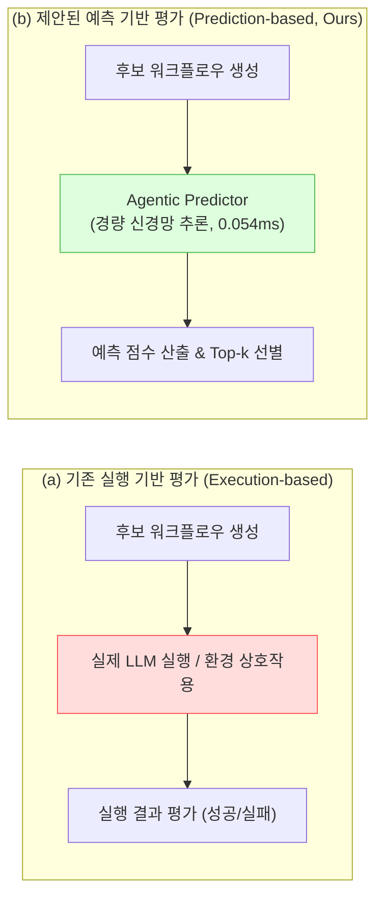
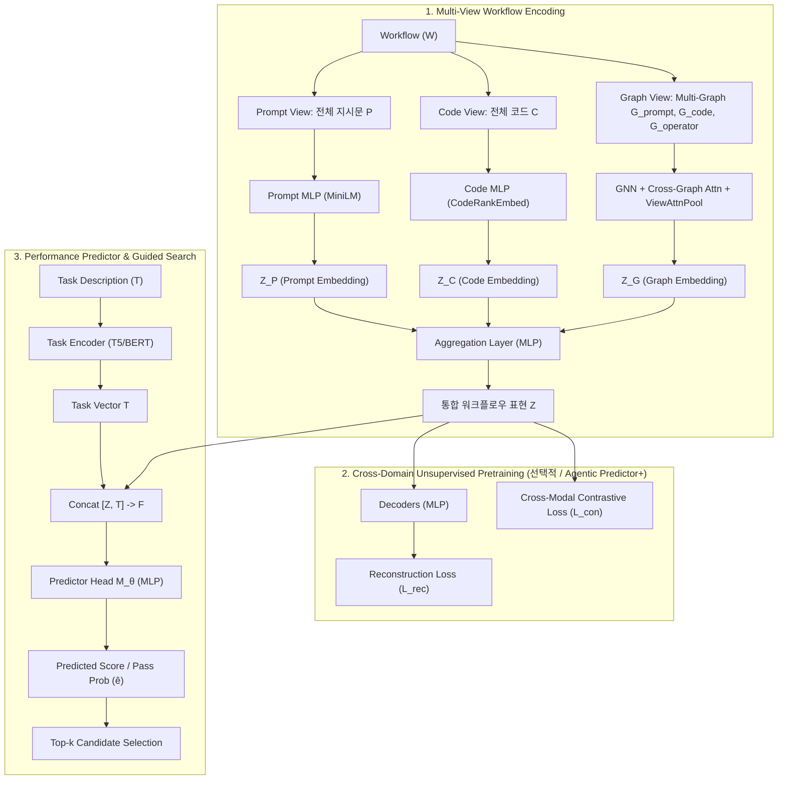

# Multi-View Encoders for Performance Prediction in LLM-Based Agentic Workflows

- **원제**: Multi-View Encoders for Performance Prediction in LLM-Based Agentic Workflows
- **저자**: Patara Trirat¹, Wonyong Jeong¹, Sung Ju Hwang¹'² (¹DeepAuto.ai, ²KAIST)
- **출판/타겟**: ICLR 2026 제출 (arXiv: 2505.19764)
- **공식 저장소**: [GitHub - DeepAuto-AI/agentic-predictor](https://github.com/DeepAuto-AI/agentic-predictor)
- **대상 파일**: [0_iclr.tex](file:///home/sungjaean/papers/Multi-View_Encoders_for_Performance_Prediction_in_LLM-Based_Agentic_Workflows_2505.19764/0_iclr.tex), [1_Introduction.tex](file:///home/sungjaean/papers/Multi-View_Encoders_for_Performance_Prediction_in_LLM-Based_Agentic_Workflows_2505.19764/1_Introduction.tex), [3_Method.tex](file:///home/sungjaean/papers/Multi-View_Encoders_for_Performance_Prediction_in_LLM-Based_Agentic_Workflows_2505.19764/3_Method.tex), [4_Experiments.tex](file:///home/sungjaean/papers/Multi-View_Encoders_for_Performance_Prediction_in_LLM-Based_Agentic_Workflows_2505.19764/4_Experiments.tex), [7_Appendix.tex](file:///home/sungjaean/papers/Multi-View_Encoders_for_Performance_Prediction_in_LLM-Based_Agentic_Workflows_2505.19764/7_Appendix.tex)

---

## 1. Executive Summary (핵심 요약)

본 논문은 대규모 언어 모델(LLM) 기반의 복합 에이전트 시스템(Agentic Workflows)을 최적화할 때 발생하는 **막대한 LLM API 호출 비용 및 실행 지연 문제를 해결하기 위한 경량 성능 예측기(Performance Predictor)** 인 **`Agentic Predictor`** 를 제안합니다.

Neural Architecture Search (NAS) 분야의 성능 예측기 개념을 에이전트 워크플로우 탐색에 도입하여, **실제 환경에서 LLM을 구동하지 않고도 후보 워크플로우의 성공 여부 및 순위를 고속으로 정확하게 판별**합니다. 

### 핵심 차별성
1. **Multi-View Workflow Encoding**: 에이전트 간 통신 구조(Graph), 프로그램 로직 및 도구 호출(Code), 에이전트 역할 및 지시문(Prompt)을 포괄하는 다중 뷰 표현 학습.
2. **Cross-Domain Unsupervised Pretraining (Agentic Predictor+)**: 라벨(성공/실패 실행 결과)이 부족한 실제 환경을 고려하여 대규모 무라벨 워크플로우를 활용한 대조 학습(Contrastive) 및 재구성(Reconstruction) 비지도 사전학습.
3. **극단적인 경제성과 속도**: 후보 평가 시 샘플당 **0.054ms**의 초고속 추론 시간 및 사실상 **$0**의 탐색 비용 달성 (기존 Few-shot LLM 추론 대비 속도 수만 배 향상, 비용 급감).

---

## 2. 연구 배경 및 동기 (Background & Motivation)

### 2.1 기존 에이전트 설계 패러다임의 한계
- **수작업 엔지니어링 (Manual Engineering)**: MetaGPT, ChatDev 등은 사람이 정적으로 구조를 정의하여 도메인 적응성과 확장성에 한계가 존재.
- **자동화된 에이전트 설계 (Automated Design)**: ADAS, AFlow, GPTSwarm 등 탐색 알고리즘을 사용해 최적 구성을 자동 발견하는 연구들이 등장.
- **치명적 병목: "Execution-based Candidate Evaluation"**
  - 탐색 과정에서 수백~수천 개의 후보 워크플로우를 검증하기 위해 **매 단계마다 비싼 LLM API를 실제로 호출하여 실행**해야 함.
  - 이로 인해 시간과 API 비용이 기하급수적으로 증가하여 실제 배포가 어려움.

### 2.2 해결해야 할 2대 핵심 도전과제
1. **Workflow Heterogeneity (워크플로우의 높은 이종성)**
   - 토폴로지 구조, 프롬프트 문구, 도구 사용 방식, 제어 흐름(조건 분기, 루프) 등 미세한 차이에도 성능이 극단적으로 달라짐. 단순한 단일 DAG 그래프 모델로는 이를 포착하기 어려움.
2. **Scarcity of Labeled Data (라벨 데이터 희소성)**
   - 워크플로우의 실행 성공률(Ground-truth label)을 얻는 것 자체가 LLM 호출 비용을 수반하므로, 예측기 훈련에 사용할 수 있는 지도학습 데이터가 극도로 부족함.

---

## 3. 기존 연구와의 비교 (Related Work)

| 프레임워크 | Multi-View Representation | Unsupervised Pretraining | Lightweight Predictor | Search Agnostic |
| :--- | :---: | :---: | :---: | :---: |
| **MAS-GPT** (2025) | ❌ | ❌ | ❌ (LLM Fine-tuning) | ❌ |
| **FLORA-Bench** (2025) | ❌ (단일 뷰 그래프) | ❌ | ✅ | ✅ |
| **Agentic Predictor** (본 연구) | ✅ (Graph + Code + Prompt) | ✅ (대조학습 + 재구성) | ✅ (0.054ms / 0.49GB) | ✅ |

- **MAS-GPT**: LLM 자체를 파인튜닝하여 한 번에 워크플로우를 생성하려 하지만, 사전학습 부재 및 무거운 LLM 기반이라 탐색에 직접 결합하기 어려움.
- **FLORA-Bench**: 최초의 벤치마크 및 GNN 예측기를 제안했으나, 프롬프트를 단순 노드 피처로만 취급하는 단일 그래프 모델에 머무르며 비지도 사전학습 체계가 없음.

---

## 4. 제안 방법론: Agentic Predictor

### 4.1 문제 정의 (Problem Formulation)
- 에이전트 워크플로우는 $\mathcal{W} = \{\mathcal{V}, \mathcal{E}, \mathcal{P}, \mathcal{C}\}$로 정의:
  - $\mathcal{V} = \{v_i\}_{i=1}^N$: $N$개의 에이전트 노드
  - $\mathcal{E}$: 에이전트 간 의존성 및 통신 채널을 나타내는 방향성 엣지 (DAG)
  - $\mathcal{P} = \{p_i\}_{i=1}^N$: 각 에이전트의 시스템/지시 프롬프트
  - $\mathcal{C}$: 워크플로우 전체의 파이썬 구현 코드
- 태스크 설명 $T$와 워크플로우 $\mathcal{W}$가 주어졌을 때, 예측기 $\mathcal{M}_\Theta$는 LLM을 구동하지 않고 성능 $e$를 추정:
  $$\hat{e} = \mathcal{M}_\Theta(\mathcal{W}, T)$$
- 학습 목적식:
  $$\min_\Theta \mathbb{E}_{(\mathcal{W}, T)} [\mathcal{L}(e, \hat{e})]$$
  (이진 분류 시 Binary Cross-Entropy, 회귀 시 MSE 사용)

### 4.2 Multi-View Workflow Encoding (상세 아키텍처)
1. **Graph View ($\mathbf{Z}_{\mathcal{G}}$)**:
   - **Multi-Graph 설계**: 노드와 엣지는 공유하되 노드 속성을 세 가지로 분리
     - $\mathcal{G}_{\text{prompt}}$: 각 에이전트 프롬프트 임베딩
     - $\mathcal{G}_{\text{code}}$: 각 에이전트의 함수 호출 코드 임베딩
     - $\mathcal{G}_{\text{operator}}$: 오퍼레이터 타입 및 정의 임베딩
   - 각 그래프를 GNN으로 인코딩한 뒤, 노드 레벨에서 **Cross-View Multi-Head Attention (MHA + Residual + LN)** 을 적용하여 서로 다른 뷰 간의 상호작용을 포착.
   - **View-Attention Pooling**: MLP + Softmax를 통해 노드별로 가장 유용한 뷰에 가중치를 부여하여 통합 노드 임베딩 산출.
   - **Graph Readout ($G_{\text{pool}}$)**: 최종 그래프 수준 임베딩 $\mathbf{Z}_{\mathcal{G}}$ 도출.
2. **Code View ($\mathbf{Z}_{\mathcal{C}}$)**:
   - 워크플로우 전체 소스코드 $\mathcal{C}$를 `CodeRankEmbed`로 인코딩한 뒤 $L$-layer MLP를 거쳐 프로그램 전역의 제어 흐름, 계산 복잡도, 도구 사용 패턴을 압축.
3. **Prompt View ($\mathbf{Z}_{\mathcal{P}}$)**:
   - 워크플로우 전체의 시스템 지시문을 `all-MiniLM-L6-v2`로 인코딩한 뒤 $L$-layer MLP를 통해 전체 에이전트 역할과 전역 컨텍스트를 압축.
4. **Aggregation Layer**:
   - 세 모달리티를 연결(Concatenate)한 후 MLP 융합 레이어를 통과시켜 단일 연속 벡터 $\mathbf{Z} \in \mathbb{R}^d$ 산출:
     $$\mathbf{Z} = \mathrm{MLP}([\mathbf{Z}_{\mathcal{G}}, \mathbf{Z}_{\mathcal{C}}, \mathbf{Z}_{\mathcal{P}}])$$

### 4.3 Cross-Domain Unsupervised Pretraining (Agentic Predictor+)
라벨이 부족한 상황을 타개하기 위해, 도메인이 다른 대규모 무라벨 워크플로우 풀($M=232,104$개)을 활용해 사전학습 수행.
- **Reconstruction Loss ($\mathcal{L}_{rec}$)**:
  $$\mathcal{L}_{rec} = \frac{1}{M} \sum_{i=1}^M \left( \|\mathcal{G}_i - \hat{\mathcal{G}}_i\|^2 + \|\mathcal{C}_i - \hat{\mathcal{C}}_i\|^2 + \|\mathcal{P}_i - \hat{\mathcal{P}}_i\|^2 \right)$$
  (그래프 브랜치는 stop-gradient 임베딩을, 코드 및 프롬프트는 입력 공간 임베딩을 복원)
- **Cross-Modal Contrastive Loss ($\mathcal{L}_{con}$)**:
  - 동일한 워크플로우의 서로 다른 뷰 쌍($(\mathcal{G}, \mathcal{C})$, $(\mathcal{G}, \mathcal{P})$, $(\mathcal{C}, \mathcal{P})$)을 Positive pair로, 배치 내 다른 워크플로우들을 Negative pair로 설정하는 대칭형 InfoNCE 대조 학습.
- **총 사전학습 손실**: $\mathcal{L}_{enc} = \mathcal{L}_{rec} + \mathcal{L}_{con}$

### 4.4 Task Encoder 및 Predictor-Guided Search
- **Task Encoder**: 태스크 설명 $T$를 언어모델로 인코딩하여 $\mathbf{T}$를 얻고, 워크플로우 임베딩과 결합: $\mathcal{F} = [\mathbf{Z}, \mathbf{T}]$.
- **Predictor Head**: 경량 MLP $\mathcal{M}_\Theta(\mathcal{F})$로 소량의 라벨 데이터로 파인튜닝.
- **탐색 안내 (Predictor-as-Ranker)**: 후보 $K$개를 샘플링 $\to$ $\mathcal{M}_\Theta$로 초고속 스코어링 $\to$ Top-$k$만 선택하여 최종 검증/실행.

---

## 5. 실험 설정 (Experimental Setup)

- **벤치마크 (FLORA-Bench)**:
  - 3개 도메인, 5개 데이터셋:
    - **Code Generation**: HumanEval, MBPP
    - **Math Problem Solving**: GSM8K, MATH
    - **General Reasoning**: MMLU (추가 전이성 테스트: DROP, HotpotQA)
  - 워크플로우 생성 프레임워크: G-Designer (GD), AFlow (AF)
  - 통계: 워크플로우 수 수십~수백 개, 태스크 수 수천 개, 총 50만 건 이상의 평가 샘플.
- **평가 지표**:
  - **Accuracy**: 개별 태스크-워크플로우의 실행 성공/실패(0/1) 일치율.
  - **Utility**: 모델이 예측한 성공률 기준 Top-$k$ 워크플로우 셋과 실제 Ground-Truth Top-$k$ 셋 간의 일치도 (랭킹 품질).
- **베이스라인**:
  - 비그래프 모델: MLP
  - 그래프 신경망: GCN, GAT, GCN-II, Graph Transformer, Dir-GNN, One For All (OFA)
  - Prompt 기반 Few-Shot LLM: GPT-4.1, Claude 4 Sonnet, Gemini 2.5 Flash

---

## 6. 주요 실험 결과 및 분석

### 6.1 (Q1) 주요 예측 성능 비교 (Main Results)
Agentic Predictor는 전 도메인 및 프레임워크에서 베이스라인 대비 압도적인 성능을 보였습니다.

| 모델 | CodeGD (Acc / Uti) | CodeAF (Acc / Uti) | MathGD (Acc / Uti) | MathAF (Acc / Uti) | ReasonGD (Acc / Uti) | ReasonAF (Acc / Uti) | **전체 평균 (Accuracy)** | **전체 평균 (Utility)** |
| :--- | :---: | :---: | :---: | :---: | :---: | :---: | :---: | :---: |
| **MLP** | 83.88 / 76.16 | 78.02 / 73.94 | 63.22 / 64.13 | 73.73 / 69.64 | 71.54 / 62.41 | 78.45 / 88.48 | 74.81 | 72.46 |
| **GCN** | 84.23 / 79.31 | 84.35 / 72.73 | 64.12 / 63.03 | 76.19 / 66.52 | 72.22 / 59.18 | 87.12 / **91.82** | 78.04 | 72.10 |
| **GAT** | 85.14 / 79.50 | 84.49 / 76.46 | 64.84 / 62.32 | 76.44 / 66.51 | 72.16 / 59.44 | 87.07 / 89.40 | 78.36 | 72.27 |
| **Graph Transformer** | 85.24 / 80.20 | 84.71 / 74.09 | 63.25 / 64.97 | 75.45 / 66.48 | 72.26 / 60.92 | 86.93 / 90.60 | 77.97 | 72.88 |
| **Dir-GNN** | 84.85 / 79.81 | 83.45 / 76.08 | 63.01 / 64.68 | 76.11 / 67.97 | 74.25 / 62.64 | 86.66 / 90.07 | 78.05 | 73.54 |
| **Agentic Predictor (Ours)** | **85.33** / **81.42** | **85.62** / **80.08** | **66.20** / **67.88** | **79.56** / **74.08** | **75.13** / **63.06** | **87.96** / 91.47 | **79.97** | **76.33** |
| **최고 베이스라인 대비 향상폭** | **+0.11% / +1.52%** | **+1.07% / +3.00%** | **+2.09% / +1.85%** | **+4.08% / +6.38%** | **+1.19% / +0.67%** | **+0.78% / -0.38%** | **+2.05% (+1.61p)** | **+3.79% (+2.79p)** |

- 기존 최고 베이스라인 대비 **Accuracy 최대 6.90% 향상 (평균 79.97%)**, **Utility 최대 5.87% 향상 (평균 76.33%)**.
- 특히 에이전트 구조와 상호작용이 복잡한 MathAF 태스크에서 Utility가 6.38%p 대폭 상승.

---

### 6.2 (Q2) Ablation Study (컴포넌트 검증)
AFlow 벤치마크 데이터를 사용한 컴포넌트 분해 분석 결과:

1. **Multi-View 구성 검증 (Ablation on Views)**:
   - Graph only: Acc 82.58% / Uti 73.43%
   - Code only: Acc 78.02% / Uti 73.94%
   - Graph + Code: Acc 83.21% / Uti 75.84%
   - Graph + Text: Acc 83.35% / Uti 78.23%
   - **All Views (Graph + Code + Prompt)**: **Acc 84.38% / Uti 81.88%**
   - **결론**: 단일 모달리티 대비 3개 모달리티가 모두 결합되었을 때 상호보완적 시너지가 극대화됨.
2. **Multi-Graph 기법 검증 (Single Graph vs Multi-Graph)**:
   - Single-Graph: Acc 83.47% / Uti 78.68%
   - Multi-Graph: **Acc 84.38% / Uti 81.88%**
   - **결론**: 프롬프트, 코드, 오퍼레이터를 분리된 3개의 그래프로 표현하고 교차 어텐션을 적용하는 설계가 구조적 맥락을 풍부하게 학습함.

---

### 6.3 (Q3) 라벨 비율과 비지도 사전학습 효과 (Agentic Predictor+)
- 훈련 라벨의 비율을 50%에서 10%(0.1)까지 점진적으로 줄이면서 테스트:
  - **결과**: 라벨이 10%에 불과한 극한의 환경에서도 `Agentic Predictor+`는 **73% 이상의 정확도를 안정적으로 유지**.
  - 베이스라인 GNN 및 비사전학습 모델들은 라벨이 줄어듦에 따라 성능이 급락(70% 미만으로 하락)했으나, 사전학습 모델은 격차를 오히려 더 크게 벌림.
  - 교차 도메인 무라벨 워크플로우를 활용한 사전학습이 에이전트의 구조적·행동적 모티프를 효과적으로 전이시킴을 입증.

---

### 6.4 (Q4) OOD (분포 외) 일반화 성능
1. **Cross-System Generalization**:
   - AFlow로 훈련 $\to$ G-Designer 테스트: 베이스라인 최고 59.52% $\to$ **Ours 62.05% Acc, 58.49% Utility**
   - G-Designer로 훈련 $\to$ AFlow 테스트: 베이스라인 최고 61.10% $\to$ **Ours 62.87% Acc, 59.83% Utility**
2. **Cross-Domain Generalization**:
   - 완전히 다른 태스크 도메인 간 교차 검증 (예: Code로 훈련 후 Math 테스트):
   - 평균 Accuracy **58.27%**, Utility **58.87%** 로 모든 베이스라인을 큰 폭으로 능가.

---

### 6.5 (Q5) Few-shot LLM 예측기와의 비교 및 비용 분석

| 모델 | Accuracy (%) | Utility (%) | 추론 시간 (ms/sample) | 비용 (1,000개 평가 기준) |
| :--- | :---: | :---: | :---: | :---: |
| **GPT-4.1** (5-shot) | 62.86 | 58.92 | 2,253 ms | ~$59 |
| **Claude 4 Sonnet** (5-shot) | 55.28 | 50.07 | 1,888 ms | ~$202 |
| **Gemini 2.5 Flash** (5-shot) | 57.10 | 59.11 | 2,606 ms | ~$21 |
| **Agentic Predictor (Ours)** | **84.97** | **81.37** | **0.054 ms** | **$0 (초기 훈련 1.2 GPU-시간 소요)** |

- LLM 프롬프팅 방식은 워크플로우의 복잡한 그래프 토폴로지와 실행 제어 흐름을 제대로 파악하지 못해 **단순 MLP보다도 낮은 정확도(~55~62%)** 를 기록.
- 반면 Agentic Predictor는 **정확도가 20%p 이상 높으면서도 추론 속도는 40,000배 이상 빠름**.
- **손익분기점 (Break-even)**: A100 GPU 기준 약 110~120개의 후보만 평가해도 LLM API 비용을 추월하여 경제적으로 훨씬 유리해짐.

---

### 6.6 워크플로우 최적화 보상 함수 적용 (Workflow Optimization Results)
AFlow 최적화 과정에서 후보 워크플로우 평가 시 실제 LLM 실행 대신 Agentic Predictor를 보상 함수(Reward)로 결합하여 최적화 진행:

| 최적화 방법 | MATH | GSM8K | MBPP | HumanEval | MMLU | DROP | HotpotQA | **평균 점수** | **탐색 비용 ($)** |
| :--- | :---: | :---: | :---: | :---: | :---: | :---: | :---: | :---: | :---: |
| **Ground Truth (실제 실행 평가)** | 87.38 | 94.53 | 73.22 | 97.20 | 83.10 | 84.25 | 69.94 | **84.23** | **$39.83** |
| **Random Reward** | 78.40 | 75.23 | 67.84 | 76.34 | 42.87 | 80.42 | 16.86 | 62.56 | **$0.00** |
| **GCN Reward** | 79.22 | 86.16 | 68.23 | 97.46 | 46.43 | 82.33 | 19.14 | 68.42 | **$0.00** |
| **GAT Reward** | 80.11 | 86.22 | **68.62** | 97.71 | 57.00 | 85.83 | **21.47** | 71.00 | **$0.00** |
| **Agentic Predictor (Ours)** | **81.89** | **92.65** | 68.42 | **98.73** | **79.70** | **86.25** | 13.37 | **74.43** | **$0.00** |

- 탐색 비용 **$0**으로 Ground Truth 최적화 수준(84.23%)에 근접하는 **평균 74.43%의 고품질 워크플로우를 도출**.
- HumanEval(98.73%) 및 GSM8K(92.65%) 등에서는 실측 평가 탐색과 거의 대등하거나 능가하는 성능을 확보.

---

## 7. 정성적 사례 연구 (Case Study)

예측기가 높은 점수를 부여하여 최종 선택된 대표 워크플로우 구조:
1. **Code Generation (HumanEval)**:
   - `CodeGenerate` $\to$ `Review` $\to$ `Automated Test` $\to$ 실패 시 `Feedback Revise & Retest` 로 이어지는 **반복적 검증 루프(Review-Test-Revise)** 가 포함된 워크플로우를 높은 점수로 정확히 판별.
2. **Math Problems (MATH)**:
   - 복수 후보 생성 $\to$ `Self-consistency Ensemble` $\to$ `추가 검토(Review)` 단계를 거치는 **앙상블 및 검증 워크플로우**를 고득점으로 선별.

---

## 8. 논문의 한계점 및 향후 연구 과제 (Limitations & Future Work)

1. **이진 평가 메트릭 중심**: 현재는 벤치마크 특성상 통과/실패(Binary Success) 위주로 모델링됨. 향후 정확도와 토큰 비용, 지연시간 등을 동시에 고려하는 다목적(Multi-Objective) 최적화로의 확장이 필요.
2. **동적 실행 추적(Temporal Traces) 부재**: 정적 그래프, 코드, 프롬프트 위주로 인코딩하므로 런타임 중에 발생하는 동적 상호작용 추적(Trace) 정보를 결합할 여지가 있음.
3. **독립적 신규 벤치마크 검증**: 현재 FLORA-Bench에 의존하고 있으므로, 더욱 다양하고 복잡한 실세계 도메인 벤치마크에서의 추가 검증이 요구됨.

---

## 9. 최종 시사점 (Key Takeaways)

1. **패러다임 전환**: 에이전트 시스템 자동 최적화의 가장 큰 걸림돌인 **LLM API 실행 비용 병목을 '성능 예측기'를 통해 완전히 우회**할 수 있음을 증명했습니다.
2. **멀티뷰 표현의 필수성**: 에이전트 워크플로우는 그래프 토폴로지만으로는 설명될 수 없으며, 코드 레벨 로직과 프롬프트 세부사항이 융합된 **다각도(Multi-View) 모델링**이 예측 정확도의 핵심 열쇠입니다.
3. **실무적 유용성**: 임의의 탐색 프레임워크(Search Agnostic)와 즉시 결합할 수 있는 플러그앤플레이(Plug-and-Play) 형태의 경량 예측 모델로서 실용성이 매우 높습니다.
