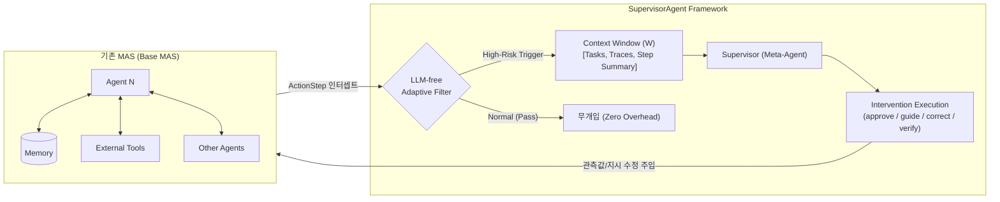
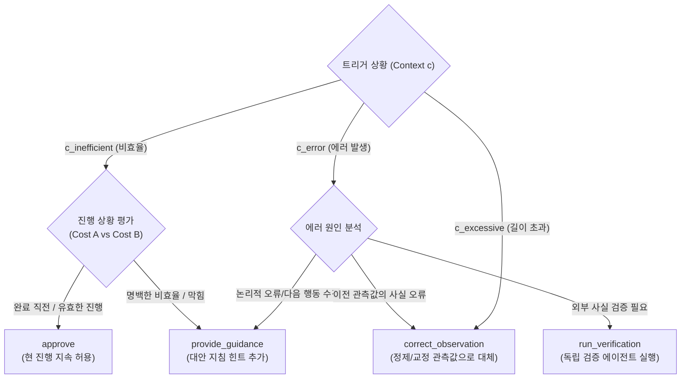

# [논문 요약] Stop Wasting Your Tokens: Towards Efficient Runtime Multi-Agent Systems

- **논문 제목**: Stop Wasting Your Tokens: Towards Efficient Runtime Multi-Agent Systems
- **저자**: Fulin Lin$^{1,*}$, Shaowen Chen$^{1}$, Ruishan Fang$^{2,1}$, Hongwei Wang$^{1,3,\dagger}$, Tao Lin$^{2,\dagger}$ ($^1$Zhejiang University, $^2$Westlake University, $^3$State Key Laboratory of CAD&CG, Zhejiang University)
- **발표/형식**: ICLR 2026 Conference Submission / arXiv: 2510.26585
- **오픈소스 코드**: [https://github.com/LINs-lab/SupervisorAgent](https://github.com/LINs-lab/SupervisorAgent)

---

## 1. Executive Summary (핵심 요약)

대규모 언어 모델(LLM) 기반의 **멀티에이전트 시스템(MAS, Multi-Agent Systems)**은 복잡한 추론, 도구 활용, 협동 작업에서 탁월한 성과를 보이고 있으나, **자율성과 상호작용 복잡도가 증가함에 따라 심각한 토큰 낭비(비경제성)와 에러 전파(비견고성)라는 'MAS의 역설'**에 직면해 있습니다.

본 논문은 기존 에이전트의 내부 아키텍처나 코어 프롬프트를 수정하지 않고 외부에 결합하는 **경량·모듈형 런타임 실시간 감독 프레임워크인 `SupervisorAgent`**를 제안합니다.

- **핵심 메커니즘**: 상호작용 단계마다 LLM을 호출하면 비용이 급증하므로, **규칙 기반의 'LLM-Free 적응형 필터(Adaptive Filter)'**가 고위험 상황(에러 발생, 비효율 루프, 과도한 길이의 관측값)만을 선별하여 감독관(Supervisor)을 호출합니다.
- **주요 전략**:
  1. **능동적 에러 교정 (Proactive Error Correction)**: 오류 발생 시 원인을 진단하여 즉시 교정 또는 검증 에이전트 호출
  2. **비효율 행동 유도 (Guidance for Inefficiency)**: 반복적인 페이지 다운 등 비효율 루프를 감지하여 지름길 힌트를 제공하거나, 마무리 단계인 경우 진행을 승인(`approve`)
  3. **적응형 관측 정제 (Adaptive Observation Purification)**: 웹페이지 HTML이나 장문 출력물에서 노이즈를 제거하고 핵심 정보만 압축
- **주요 성과**:
  - 대표 고난도 벤치마크인 **GAIA**에서 Smolagent 베이스라인 대비 성공률(정확도)을 유지하면서 **평균 29.68%의 토큰 소비를 절감** (특히 고난도 토큰 집약형 과제에서는 **50.13% 토큰 절감 및 정확도 6.67%p 상승**).
  - 수학(AIME, GSM-Hard), 코드(HumanEval, MBPP), QA(DROP) 등 5개 추가 벤치마크 전반에서 파레토 개선(Pareto improvement) 달성.
  - GPT-4.1, Gemini-2.5-pro, Qwen3 등 다양한 백본 모델 및 Smolagent, AWorld(MCP 기반), OAgents 등 상이한 MAS 프레임워크 전반에서 범용성(Agnostic) 입증.

---

## 2. 연구 배경 및 문제 정의 (Motivation & Problem Statement)

### 2.1 멀티에이전트 시스템의 역설 (The Paradox of MAS)
LLM 에이전트들이 협력하는 시스템(ReAct, 계층적 MAS, 자율진화 시스템 등)은 복잡한 다단계 과제를 해결할 수 있지만, 복잡해질수록 다음과 같은 치명적 결함이 발생합니다:
1. **취약한 견고성 (Robustness Bottleneck - Error Propagation)**:
   - 에이전트 간(Agent-Agent), 에이전트-도구 간(Agent-Tool), 에이전트-메모리 간(Agent-Memory) 상호작용 체인이 길어집니다.
   - 어느 한 에이전트가 생성한 단 하나의 작은 환각(Hallucination)이나 잘못된 도구 호출 결과가 메모리나 공유 컨텍스트에 기록되면, **하류(Downstream) 에이전트들 전체로 오류가 전파·증폭**되어 시스템 전체가 회복 불능 상태에 빠집니다.
2. **극심한 경제적 비효율성 (Economic Inefficiency - Excessive Cost)**:
   - **과도한 관측값 길이(Excessive Observations)**: 웹 브라우징 중 수만 자에 달하는 원시 HTML이나 장황한 API 로그가 컨텍스트 윈도우를 가득 채워 토큰 비용을 폭증시키고, 중요한 정보를 가려 에이전트의 집중력을 분산시킵니다.
   - **비최적/반복 루프(Sub-optimal Inefficient Loops)**: 에이전트가 특정 웹사이트에서 직접 검색 기능을 쓰지 못하고 80페이지에 달하는 블로그를 무한정 `page_down`으로 넘기거나 불필요한 시도를 반복하는 궤도 이탈 현상이 발생합니다.

### 2.2 기존 연구의 한계
| 구분 | 대표 연구 | 접근 방식 | 한계점 |
| :--- | :--- | :--- | :--- |
| **사후 원인 분석**<br>(Failure Attribution) | Aegis, SHIELDA, AgenTracer, A2P | 작업 실패 후 사후적(Post-hoc)으로 에러 원인을 역추적/분류 | 수동적(Reactive) 대응에 불과하며, 런타임 실패 및 자원 낭비를 사전에 예방하지 못함 |
| **설계 시점 최적화**<br>(Design-time Pruning) | AgentDropout, SafeSieve, MetaAgent, HiVA | 에이전트 구조 가지치기, 통신 링크 축소, 정적 토폴로지 설계 | 작업 실행 중 동적으로 발생하는 비효율 루프나 돌발 에러에 적응하지 못함 |
| **컨텍스트 압축**<br>(Context Compression) | SMURFS, EcoLang | 정적 요약 또는 텍스트 증류 기법 | 에이전트 추론에 중요한 환경적 구조(HTML 링크 등)를 과도하게 제거하여 도리어 성능 하락 유발 가능 |

> **본 논문의 관점**: 기존 시스템의 정적 수정이 아닌, **실행 시간 프로세스 제어(Runtime Process Control)**를 수행하는 비침습적(Non-intrusive) 메타 제어자가 필수적입니다.

---

## 3. 시스템 공식화 (Supervised MAS Formalism)

본 논문은 일반 멀티에이전트 시스템(MAS)에 메타 레벨 제어자인 **Supervisor**를 결합한 **Supervised Multi-Agent System (SMAS)**을 공식화합니다.



### 3.1 3대 고위험 상호작용 지점 (High-Risk Interaction Loci)
1. **Agent-Agent 상호작용**: 에이전트 간 지시 및 결과 위임 채널. 환각이나 부정확한 추론이 전파되는 주원인.
2. **Agent-Tool 상호작용**: 외부 API 및 코드 실행 채널. 잘못된 파라미터 전달, 만료/오류 데이터 반환, 과도한 raw 텍스트 유입의 원천.
3. **Agent-Memory 상호작용**: 장단기 메모리 조회 채널. 오래되거나 오염된 과거 경험 참조 위험.

### 3.2 Supervisor의 상태 컨텍스트 윈도우 ($\mathcal{W}$)
Supervisor는 개별 에이전트보다 거시적인 시야를 확보하기 위해 다음과 같은 튜플로 컨텍스트를 구성합니다:
$$\mathcal{W} = (N, Q_g, Q_l, T_l, S)$$
- $N$: 현재 검토 중인 에이전트 식별자
- $Q_g$: 전체 시스템의 궁극적 목표 (Global Task)
- $Q_l$: 해당 에이전트의 현재 세부 목표 (Local Task)
- $T_l$: 해당 에이전트의 최근 행동 및 관측 요약 이력 (Local Trace)
- $S$: 가장 최근 상호작용 단계 요약 (Latest Step Summary)
- *확장 컨텍스트($\mathcal{W}_{\text{ext}} = \mathcal{W} \cup \{T_g\}$)*: 시스템 차원의 비효율 분석 시 모든 에이전트의 상호작용 기록인 글로벌 트레이스($T_g$)를 추가 참조.

---

## 4. 핵심 방법론 (Methodology: What, When, How)

### 4.1 What: 무엇을 감독하는가?
에이전트가 수행하는 매 상호작용 단위를 캡슐화한 **`ActionStep` 객체**를 인터셉트합니다.
- 구성 요소: 에이전트 사고 과정(`model_output`), 도구 호출 명령(`tool_calls`), 결과 관측값(`observations`), 예외 에러 객체(`error`).

### 4.2 When: 언제 개입하는가? (Heuristic-Based Adaptive Filter)
모든 단계에서 LLM을 호출하면 지연 시간과 토큰 비용이 역전됩니다. 따라서 **LLM을 사용하지 않는 초경량 휴리스틱 우선순위 체인**을 통해 위험을 선별합니다:

```
[입력: 실행 이력 H, 관측값 o, 에러 상태 e]
  │
  ├─ Priority 1. 서브에이전트 완료 보고 (<summary_of_work> 포함)
  │    └─ 즉시 관측값 정제(Adaptive Observation Purification) 트리거
  │
  ├─ Priority 2. 명시적 런타임 에러 발생 (e is True)
  │    └─ 즉시 에러 교정(Proactive Error Correction, c_error) 트리거
  │
  ├─ Priority 3. 비효율 행동 패턴 감지
  │    ├─ 주기적 전략 점검: 현재 단계수 N > 0 이고 N % τ_step == 0
  │    └─ 동일 행동 무한 루프: 최근 τ_loop 윈도우 내 실행 도구가 모두 동일한 경우
  │         └─ 비효율 유도(Guidance for Inefficiency, c_inefficient) 트리거
  │
  ├─ Priority 4. 과도한 관측값 길이
  │    └─ Length(o) > τ_len (기본값: 3,000자)
  │         └─ 관측값 정제(Adaptive Observation Purification, c_excessive) 트리거
  │
  └─ 위 조건 모두 미해당
       └─ 트리거 False -> 기본 승인 (LLM 호출 없음, 오버헤드 0)
```

#### 하이퍼파라미터 설정
- $\tau_{\text{step}}$ (주기 점검 간격): GAIA=8, HumanEval=6, MBPP/AIME/DROP/GSM=4 (OAgents=6)
- $\tau_{\text{loop}}$ (루프 감지 윈도우): GAIA/HumanEval=5, 기타=3 (OAgents=3)
- $\tau_{\text{len}}$ (관측값 길이 임계치): 표준=3,000자 (OAgents의 경우 장문 출력이 잦아 10,000자로 설정)

---

### 4.3 How: 어떻게 개입하는가? (다수준 개입 액션 스펙트럼)

Supervisor는 상황($c$)에 따라 엄격히 정의된 액션 공간 $\mathcal{A}(c)$에서 최적의 액션을 선택합니다:

$$\mathcal{A}(c) = \begin{cases} 
\{ \text{correct\_observation}, \text{provide\_guidance}, \text{run\_verification} \} & \text{if } c = c_{\text{error}} \\
\{ \text{approve}, \text{provide\_guidance} \} & \text{if } c = c_{\text{inefficient}} \\
\{ \text{correct\_observation} \} & \text{if } c = c_{\text{excessive}} 
\end{cases}$$



1. **`approve` (최소 개입)**:
   - 비효율 플래그가 떴더라도 에이전트가 13개 페이지 중 10페이지를 완료하여 완수가 임박한 경우, 도중에 중단시키면 오히려 시작 비용(Cost B)이 더 큽니다. 이 경우 작업을 중단하지 않고 승인하여 프로세스를 보호합니다.
2. **`provide_guidance` (중간 개입)**:
   - 기존 관측 데이터는 그대로 유지하고, 끝부분에 `[Supervisor's Note: ...]` 형태로 간결하고 직접적인 방향 전환 힌트(예: "스크롤을 멈추고 site search 검색창을 이용해 특정 날짜 키워드로 검색하라")를 덧붙입니다.
3. **`correct_observation` (직접 개입)**:
   - 기존 원시 관측값(수만 자의 HTML 등)을 의미적 구조(제목, 링크 속성 등)는 유지하면서 불필요한 속성(`class`, `style`, `script`)을 제거한 압축 텍스트로 완전히 대체합니다.
4. **`run_verification` (심층 개입)**:
   - 내부 정보만으로 에러를 해결할 수 없을 때, 독립적인 외부 검증 서브에이전트를 호출하여 정확한 사실 확인을 거친 후 결과를 주입합니다.

---

## 5. 실험 및 결과 분석 (Experiments & Findings)

### 5.1 실험 셋업
- **주요 벤치마크**: GAIA (Validation set, 165개 고난도 멀티모달·복합 웹 과제)
- **일반화 벤치마크 (5종)**:
  - 수학: AIME 2024, GSM8k-Hard (600 샘플)
  - 코드: HumanEval (164 전수), MBPP (500 전수)
  - QA: DROP (800 샘플)
- **베이스라인**: Single Agent(Vanilla, CoT-SC, CodeAgent), Multi-Agent(Smolagent, OWL, OAgents, MetaAgent, AWorld)
- **백본 LLM**: GPT-4.1 (주력), Gemini-2.5-pro, Qwen3-235B, Qwen3-32B

---

### 5.2 GAIA 벤치마크 메인 결과 (성공률 및 토큰 소비)

`SupervisorAgent`를 Smolagent 프레임워크에 결합한 결과, 정확도를 완벽히 유지하거나 개선하면서 극적인 토큰 절감을 달성했습니다.

| 모델 및 구성 | 전체 정확도 (Avg Acc, %) | 전체 토큰 (Avg Tokens, K) | Level 1 토큰 (K) | Level 2 토큰 (K) | Level 3 토큰 (K) |
| :--- | :---: | :---: | :---: | :---: | :---: |
| **Smolagent (pass@1)** | 50.91 | 527.76 | 298.51 | 619.59 | 691.33 |
| **+ SMAS (SupervisorAgent)** | **50.91** | **371.12 (↓29.68%)** | **258.28 (↓13.48%)** | **404.96 (↓34.64%)** | **489.22 (↓29.23%)** |
| **Smolagent (pass@2)** | 58.18 | 467.19 | 275.85 | 548.02 | 589.92 |
| **+ SMAS (SupervisorAgent)** | **58.79 (↑0.61%)** | **389.54 (↓16.62%)** | **270.07 (↓2.10%)** | **420.97 (↓23.18%)** | **529.20 (↓10.29%)** |
| **Smolagent (pass@3)** | 61.82 | 502.40 | 282.14 | 605.05 | 611.87 |
| **+ SMAS (SupervisorAgent)** | **63.03 (↑1.21%)** | **369.52 (↓26.45%)** | **276.84 (↓1.88%)** | **409.05 (↓32.39%)** | **427.72 (↓30.10%)** |

> **핵심 포인트**: 과제 난이도가 높아질수록(Level 2, Level 3) 토큰 절감률이 **30%~35%**에 달해 고난도 과제에서 비효율 차단 효과가 더욱 두드러졌습니다.

---

### 5.3 토큰 집약형 고난도 태스크 (Token-Intensive Subset) 분석
GAIA 각 난이도별 상위 10개 최다 토큰 소모 과제(총 30개 과제)를 대상으로 한 극한 상황 평가:

| 기법 | 평균 정확도 (%) | 평균 토큰 (Tokens) | L1 토큰 | L2 토큰 | L3 토큰 |
| :--- | :---: | :---: | :---: | :---: | :---: |
| **Smolagent** | 40.00 | 1,446,526 | 933,013 | 2,037,437 | 1,369,131 |
| **+ SMAS (전체)** | **46.67 (↑6.67%)** | **721,332 (↓50.13%)** | **522,364 (↓44.01%)** | **960,694 (↓52.85%)** | **680,939 (↓50.26%)** |
| w/o Correction (에러교정 제거) | 40.00 | 719,075 (↓50.28%) | 426,786 | 755,543 | 974,895 |
| w/o Guidance (비효율안내 제거) | 40.00 | 706,831 (↓51.14%) | 453,623 | 913,109 | 753,761 |
| w/o Purification (정제 제거) | 46.67 (↑6.67%) | 851,747 (↓41.11%) | 585,411 | 990,769 | 979,061 |

- **토큰 소모가 50.13% 절감**되었을 뿐만 아니라, 컨텍스트 오버플로우나 추론 이탈로 실패하던 과제들을 살려내어 **정확도가 40.00%에서 46.67%로 대폭 향상**되었습니다.

---

### 5.4 다분야 일반화 벤치마크 결과 (Generalization)
Qwen3-32B 백본 기반으로 5대 벤치마크 평가 결과:

| Benchmark | 도메인 | Base (Smolagent) Acc/F1 | Base Tokens (K) | + SMAS Acc/F1 | + SMAS Tokens (K) | 토큰 절감율 |
| :--- | :---: | :---: | :---: | :---: | :---: | :---: |
| **GSM-Hard** | 수학 | 74.33% | 11.59 | **75.50%** | 10.55 | **↓8.92%** |
| **AIME 2024** | 수학 (고난도) | 30.00% | 59.14 | **36.67% (+6.67%p)** | 47.95 | **↓18.92%** |
| **HumanEval** | 코드 생성 | 92.07% | 40.91 | **92.68%** | 31.19 | **↓23.74%** |
| **MBPP** | 코드 생성 | 85.68% | 111.07 | 84.43% | 103.71 | **↓6.62%** |
| **DROP** | 질의응답 (F1) | 81.08% | 12.01 | 79.80% | 11.34 | **↓5.60%** |

- 수학(AIME) 및 코드(HumanEval) 영역에서 불필요한 디버깅 루프와 장황한 코드 출력을 제어하여 **정확도 향상과 함께 18~24% 수준의 높은 토큰 절감**을 기록했습니다.

---

### 5.5 모델 및 프레임워크 무관성 (Model & Framework Agnostic)

1. **백본 모델 무관성 (Model-Agnostic)**:
   - GPT-4.1, Gemini-2.5-pro, Qwen3-235B 등 최상위 LLM 전반에서 일관되게 20%~35% 토큰 절감 및 안정적 성능 확인.
2. **MAS 프레임워크 무관성 (MAS-Agnostic)**:
   - **AWorld (MCP 기반 연동)**: AWorld의 자체 Guard 에이전트 대비 SMAS 적용 시 **토큰 36.54% 절감 및 정확도 +6.67%p 향상** (L3 과제에서는 48.38% 토큰 절감).
   - **OAgents (계층형 MAS)**: 메모리와 도구 호출이 방대한 OAgents에서도 **토큰 39.36% 절감** (L1 과제에서 50.19% 절감).

---

## 6. 심층 분석 및 어블레이션 (In-Depth Analysis & Ablation)

### 6.1 모듈별 기여도 (Ablation Study)
- **Adaptive Observation Purification (관측값 정제)**: **비용 절감의 절대적 주역**. 제거 시 토큰 절감폭이 29.68%에서 15.96%로 반토막 남.
- **Proactive Error Correction & Guidance (에러 교정 및 비효율 안내)**: **정확도 및 시스템 견고성의 수호자**. 제거 시 토큰 절감은 유지되나 정확도가 각각 47.88%, 48.48%로 급락.

### 6.2 오버헤드 분석 (Overhead Analysis)
- **토큰 오버헤드 (Token Overhead)**:
  - 본 논문에서 보고된 모든 절감 수치는 Supervisor 자신의 LLM 호출 비용을 모두 합산한 **순 절감치(Net Savings)**입니다.
  - Supervisor가 사용하는 토큰은 전체 베이스라인 토큰의 **약 15.45%**에 불과하며, 절감시키는 토큰이 훨씬 크므로 순수 이득이 발생합니다.
- **지연 시간 (Latency Overhead)**:
  - 태스크당 평균 실행 시간은 약 233.96초에서 321.15초로 약 87초(1.5분 미만) 증가.
  - 이 지연 시간의 대부분은 Observation Purification(장문 관측 텍스트 압축 LLM 호출)에서 발생하며, 에러 교정 및 가이던스 모듈의 지연 영향은 미미함.

### 6.3 분산 감소 및 견고성 (Robustness & Consistency)
- 과제별 토큰 소모량의 바이올린 플롯(Violin plot) 분석 결과, 베이스라인의 길게 늘어진 비효율 꼬리(Extreme Outliers)가 대폭 제거됨.
- **토큰 비용 분산이 최대 63% 감소**하여, 실제 프로덕션 환경에서 비용 예측 가능성과 안정성을 현저히 개선함.

---

## 7. 실제 사례 연구 (Case Study: GAIA Level 3)

- **과제 내용**: 사진 속 개들이 착용한 하네스 브랜드 웹사이트에서 '2022년 12월 8일자 앰버서더 스토리'에 언급된 '육류(meat)' 종류 찾기.
- **기존 Smolagent의 실패 과정**:
  1. 첫 번째 검색 에이전트: 82페이지에 달하는 블로그 목록에서 `page_down`만 10번 누르다가 찾지 못하고 종료.
  2. 두 번째 검색 에이전트: Wayback Machine 아카이브 접속 시도 후 또 `page_down` 7번 반복 후 실패.
  3. 세 번째 검색 에이전트: 소셜 미디어와 웹 전반을 방황하다 결국 *"찾을 수 없음(Unable to determine)"*으로 오답 제출.
- **SupervisorAgent 적용 시 해결 과정**:
  1. 에이전트가 `page_down` 루프에 빠지자 Supervisor가 즉각 개입: *"수동으로 스크롤하지 말고, 웹 검색 도구 또는 사이트 검색창에 'Ruffwear ambassador story December 8 2022'를 직접 쿼리하라"*는 지침(`provide_guidance`) 제공.
  2. 에이전트가 즉시 해당 기사 페이지를 발견.
  3. 발견된 47,902자 분량의 웹페이지 내용을 Supervisor가 1,438자의 핵심 본문으로 압축(`Adaptive Observation Purification`).
  4. 본문 속 *"New Year's Day bacon"* 문구를 추출하여 **정답인 'bacon'을 정확히 도출**.
  - **결과**: **총 스텝 수 43% 단축, 토큰 소모량 70% 이상 절감**.

---

## 8. 한계점 및 실패 모드 (Limitations & Failure Modes)

1. **정제 과정에서의 정보 손실 (Information Loss during Purification)**:
   - 20만 자가 넘는 초장문 페이지의 경우 요약 과정에서 희귀한 단서가 누락되거나 환각이 개입할 위험이 존재함. ("Noise as Signal" 딜레마: 때로는 원시 HTML 태그나 잘림 표시가 에이전트에게 중요한 신호가 됨).
2. **비효율 안내의 한계 및 지연 방지 제약**:
   - Supervisor의 힌트를 에이전트가 제대로 따르지 못해 교정 루프가 반복되는 것을 방지하기 위해 **서브태스크당 최대 2회까지만 개입하도록 하드 리밋(Hard Constraint)**을 적용함.
3. **백본 모델 역량 의존성**:
   - 하위 모델(예: Qwen3-235B)의 경우 기본적인 JSON 포맷 오류나 도구 호출 문법 에러가 빈번하여 `Error Correction` 트리거가 너무 자주 발생 -> Supervisor 자체의 토큰 오버헤드가 증가하여 순 절감율이 낮아지는 경향이 있음.

---

## 9. 종합 평가 및 시사점

| 평가 항목 | 내용 |
| :--- | :--- |
| **창의성 및 참신성** | 사후 디버깅이나 정적 아키텍처 수정을 넘어, **LLM-free 적응형 필터와 다수준 런타임 제어 메타 에이전트를 결합**하여 비용 효율적인 실시간 프로세스 제어를 실현함. |
| **실용성 및 확장성** | 기존 에이전트 코드를 한 줄도 수정할 필요 없는 **비침습적(Non-intrusive) 콜백/MCP 방식**으로, 기존 MAS 프레임워크(Smolagent, AWorld, OAgents 등)에 즉시 플러그앤플레이 적용 가능. |
| **철저한 검증** | 에이전트 자체 오버헤드를 포함한 **순수 절감치(Net Savings)**를 보고하였으며, 6대 벤치마크, 다양한 LLM, 어블레이션, 지연시간, 분산 분석까지 포괄적인 검증을 완료함. |
| **미래 연구 방향** | 휴리스틱 규칙을 넘어서는 **학습 기반(RL) 적응형 필터 개발**, 정제 시 지연시간 단축, MAS 전용 통합 자원 소비 표준 지표 수립 제시. |
